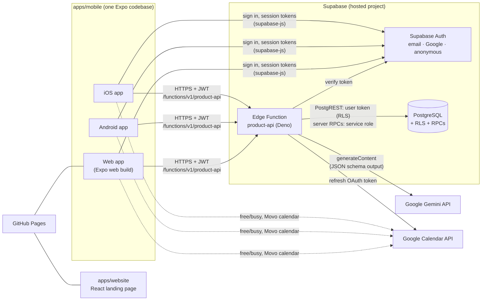
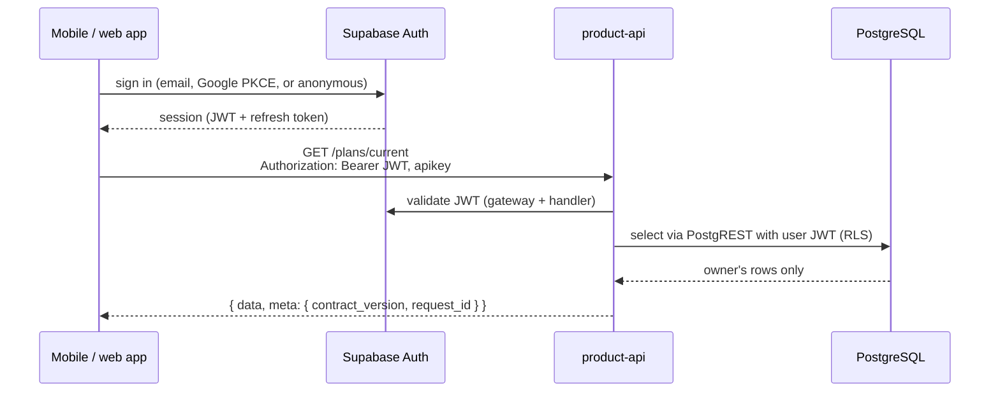
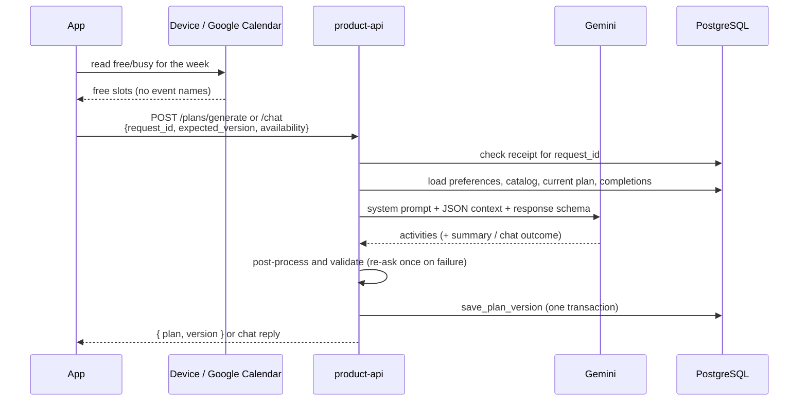
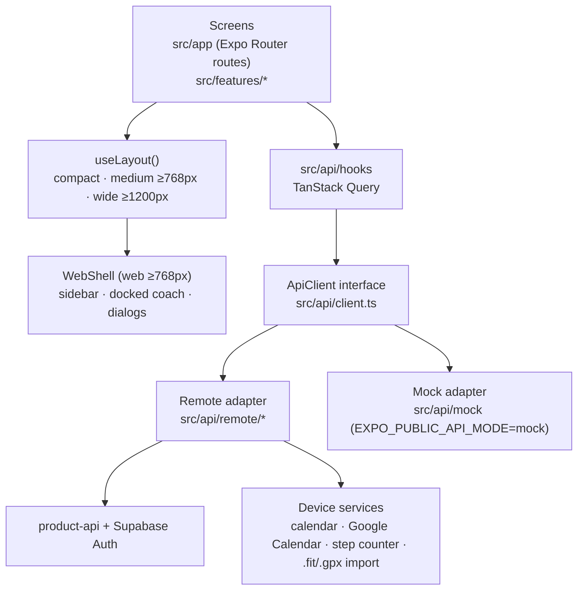

# Architecture overview

A short introduction to how the project fits together and why. Details live in
the linked feature docs; this page only explains the shape of the system.

## The system at a glance

| Layer | Decision | Why |
| --- | --- | --- |
| Database | **Supabase-hosted PostgreSQL** (project FitnessApp) | Managed Postgres, Auth and serverless functions in one place; no servers to run during a hackathon. |
| Auth | **Supabase Auth**: email/password, Google OAuth, anonymous (web guest) | Clients get JWTs that both the function and RLS understand. |
| API | **One Edge Function, `product-api`** (Deno, TypeScript) | A single, versioned HTTP API for all clients, with server-side validation and secrets. |
| AI | **Gemini**, called only from the function, behind a `PlanGenerator` port | API keys never reach clients; the provider can be swapped. |
| Clients | **One Expo (React Native) app** for iOS, Android and web | One codebase for logic, API client and copy; only layout differs on desktop. |
| Website | **React + Vite landing page** | Static marketing page; its calls to action open the web app. |
| Hosting | **GitHub Pages** for the landing page (`/`) and web app (`/app/`) | Free static hosting, deployed by the `pages.yml` workflow from `main`/`develop`. |
| Contracts | **`packages/contracts`** (Zod schemas + TypeScript types) | One home for the API shape; the function, clients, OpenAPI and JSON schemas derive from it. |
| Backend (NestJS) | **Kept, but not on the product path** | Available for future work; currently only a health endpoint and a library-style AI module. |

## Tech stack

| Area | Stack |
| --- | --- |
| Monorepo | npm workspaces (pnpm is the agreed target), TypeScript everywhere, shared ESLint/Prettier |
| Mobile + web app | Expo SDK 57, React Native 0.86, React 19, Expo Router, TanStack Query, supabase-js, Reanimated, react-native-web |
| Product API | Supabase Edge Functions (Deno), native `fetch`, Zod (same version as contracts) |
| Database | PostgreSQL with row-level security, SQL migrations in `supabase/migrations`, tests on PGlite |
| AI | Google Gemini `generateContent` with structured JSON output |
| Website | React 18, Vite |
| Wearables | `packages/wearable-data` (server-only Node library, Garmin FIT SDK) and on-device step counting (Core Motion, Health Connect) |
| CI/CD | GitHub Actions: typecheck and build on PRs, deploy to Pages from `main`/`develop` |

## How clients talk to the database

Clients **never query tables directly**. They use supabase-js only for Auth and
call the product API for all data. The function then talks to PostgreSQL in
two ways:

- **As the user**: PostgREST calls carry the user's JWT, so row-level security
  limits every read to the caller's own rows.
- **As the server**: writes that must be atomic (`save_plan_version`,
  `save_chat_reply`) are SQL functions callable only with the service role key,
  which exists only inside the function. They check ownership, the expected plan
  version and the request ID in one transaction.

Why: the API is the single place that validates input, enforces ownership and
holds secrets, while RLS is a second wall if a query is ever wrong. Every
response uses the same `{data, meta}` / `{error, meta}` envelope, so clients map
errors once.

Key data rules:

- **Plans are immutable versions.** Each change inserts a `plan_version` and
  moves the plan's active pointer. History is kept; completed sessions are
  never altered by a revision.
- **Optimistic concurrency.** Writes send `expected_version`; a mismatch is
  `409 VERSION_CONFLICT`, and the client reloads.
- **Idempotency.** Generate, chat and completion requests carry a
  client-generated `request_id`. Retries with the same ID return the stored
  result instead of calling the AI again.

## How plan generation works

1. **The client gathers availability.** Free slots come from Google Calendar
   (if connected), else the device calendar, else the preferred-hours window.
   Only free intervals are sent, never event details.
2. **The function builds the context**: preferences, eligible sports, the gym
   exercise library, free slots cut to the preferred window, the week's kept
   sessions and recent effort, plus recent messages for chat. Usernames, emails
   and feedback notes are never sent to the model.
3. **Gemini answers in a fixed JSON schema.** Generate returns
   `{activities, summary}`; chat returns `{outcome, activities | null, message}`
   where the outcome is `plan_updated`, `reply` or `clarification`.
4. **The function post-processes and validates.** It fixes IDs, re-inserts past
   and completed sessions verbatim, and checks slots, overlaps and the catalog.
   On failure it asks Gemini once more with the problem, then returns
   `502 INVALID_AI_OUTPUT`. Transient provider errors retry with backoff inside a
   90-second deadline.
5. **Only a valid `plan_updated` result saves a new version**, which becomes
   active immediately (no confirmation step). Replies and questions save the
   messages only. The newest chat change can be undone without an AI call.

Without the Gemini secrets, AI routes answer `501 AI_NOT_CONFIGURED`, and the
app shows a provider-pending state instead of failing silently.

## Mobile and web app architecture

The web app **is** the mobile app: `apps/mobile` built with
`expo export --platform web`. One codebase, three targets.

- **Screens depend on an interface, not a backend.** `src/api/index.ts` picks
  the remote Supabase adapter (default) or the in-memory mock (offline demos
  and tests). Missing configuration shows a setup screen rather than silently
  using the mock.
- **The remote adapter** is a set of pure modules with injected dependencies
  (fetch, token, storage, clock), so it is tested in Node without React Native.
  It maps the product API to the app's model: slug sport IDs, Monday–Sunday
  weeks, change cards diffed from plan versions, and error codes.
- **Server state lives in TanStack Query**; small local state (onboarding
  draft, calendar export, pending log drafts) lives in AsyncStorage.
- **Responsive, not forked.** `useLayout()` gates every desktop branch. Native
  and web under 768 px keep the phone layout; wider web gets the sidebar,
  docked coach and multi-column pages.
- **Platform differences are explicit**: guest entry exists only on the web;
  the step counter and device calendar exist only on phones.

## Other decisions

| Decision | Reason |
| --- | --- |
| Feature PRs into `develop`, release PRs into `main` | Both branches deploy Pages; one teammate approves each PR. |
| Secrets only in Supabase function secrets | Clients carry only the publishable URL and key, which RLS makes safe to ship. |
| Guest is an anonymous Supabase user | Same API, RLS and AI path as accounts; can be upgraded to email without losing data. |
| Sports come from a database catalog with per-sport metrics | Enables new sports without app releases; previews are marked `generation_enabled: false`. |
| Plans cover one week ahead, with full history | Short horizon keeps AI output reliable and adjustable; the next week generates automatically. |
| Calendar data stays minimal | Only free slots leave the device; Google tokens are stored on the device, and only the refresh uses the server-held client secret. |
| Wearable and step data stay on the device | Server sync, history and consent are deferred. |

## Further reading

- [Supabase product API](features/supabase-product-api.md) — routes, data rules, Gemini adapter
- [Mobile app on Supabase](features/mobile-supabase-integration.md) — Auth, remote adapter, calendar
- [Web app and guest mode](features/web-app.md) — responsive shell, guest, Pages
- [Runtime status](deployment.md) — what is deployed and the owner steps
- [Development](development.md) — workspace, conventions and checks
