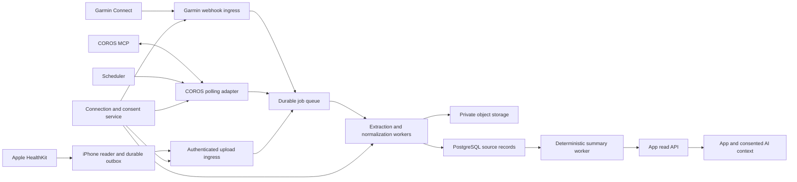

# Wearable data extraction architecture

**Version:** 1.0 draft for implementation planning

**Research date:** 2026-10-03

**Scope:** Garmin, COROS, Apple Watch through Apple Health

**Status:** architecture specification; no credentials, account connections, or working integrations have been created.

## 1. Document map and interpretation

| Document | Responsibility |
| --- | --- |
| [This document](./README.md) | Shared architecture, canonical contracts, storage, synchronization, product integration, and rollout. |
| [Garmin](./garmin.md) | Health/Activity APIs, partner access, OAuth, event-driven imports, historical extraction, and export fallbacks. |
| [COROS](./coros.md) | Official MCP, OAuth, polling, health/workout extraction, FIT budgets, and Partner API progression. |
| [Apple](./apple.md) | Native HealthKit bridge, background queries, offline uploads, deletions, and export-app prototype. |
| [Product scope](../product.md) | Current beginner-app scope and completion/feedback boundaries. |
| [Development conventions](../development.md) | Agreed NestJS, React/Expo, Supabase and shared-contract layout. |

**Provider fact** means behavior supported by a linked primary source. **Design decision** means a proposed rule for our application. **Discovery gate** means a provider-specific detail that must be established through documentation, onboarding, or an authorized test before that capability is shipped. Numerical schedules and retention defaults below are our choices unless explicitly attributed to a provider.

This document is authoritative for shared wearable field names and behavior. Provider documents describe their adapter's inputs and transformations; provider-specific examples are not automatically canonical API contracts. Revalidate dated provider facts before implementation and before release. The repository contains an Expo/React Native TypeScript starter in `apps/mobile` (Expo SDK 57 at this research date). The agreed target uses NestJS in `apps/backend`, React in `apps/web`, shared schemas in `packages/contracts`, and Supabase Auth/PostgreSQL; those remaining applications/services are planned. Queue, object-storage provider and deployment details below are proposed within those conventions.

## 2. Outcome and product boundaries

Users connect a supported source once and consent to selected datasets. Completed workouts and optional sleep/HRV become available in the app after source synchronization, with provenance, freshness, and completeness displayed. Automatic synchronization retries failures and incorporates corrections without asking users to export every workout.

Initial datasets:

1. **Completed workout summaries:** source sport, start/end, duration, distance, and available summary HR/cadence/power. Laps and time series are optional enrichment.
2. **Sleep:** episode boundaries, sleep duration and stages where provided, including naps when identifiable.
3. **HRV:** measured value, method, unit, aggregation window, and source; optional resting HR alongside it.
4. **Source-specific summaries:** sleep scores, stress, training load, and recovery indicators only when supported and explicitly enabled. Preserve vendor meaning and scale.

The product supports encouraging beginner participation. Imported data cannot create completion/feedback, infer enjoyment, change explicit preferences, or automatically replace an active plan. It cannot establish that an app activity type was tried. A user may explicitly link a recorded workout to a planned session and confirm completion; the product defines the feedback contract. Missing watch records never mean a planned session was skipped. Watch data does not establish calendar availability. The current working sports are gym, fitness, running and football; source sports are retained independently rather than forced into one of those categories.

HRV and sleep are optional context. This ingestion system computes no medical diagnoses or exercise prescriptions and automatically increases neither session duration nor intensity. Follow the current [product scope](../product.md); detailed questionnaire/planning fields remain separate feature decisions. A validated user-requested chat revision can replace the active plan under the product's transaction rules; a background import cannot do so by itself.

## 3. Integration decisions

| Source | Extraction path | Automatic trigger | Prototype path | Release gate |
| --- | --- | --- | --- | --- |
| Garmin | Official Health API + Activity API | Provider push or notification/pull after Garmin Connect sync | Consented activity FIT; separately validated wellness exports | Approved access, enabled datasets/HRV fields, callback authentication, rate/backfill limits. |
| COROS | Official authenticated MCP client | Our bounded polling scheduler | Same MCP with a consenting test account | Live tool schemas, refresh behavior, exact FIT budget, and clarification of extraction/replication terms. |
| Apple Watch | iPhone app reading HealthKit and uploading deltas | HealthKit observer/background notifications plus foreground reconciliation | Health Auto Export POST to our endpoint | Real-device HealthKit validation, iOS permissions, durable outbox, and deletion handling. |

Garmin distinguishes APIs that read completed activities from APIs that publish planned workouts. COROS exposes authenticated read tools but no MCP webhooks; Partner API is a separate integration. Apple provides a device-local HealthKit store, requiring a mobile bridge for backend access. [Garmin overview](https://developer.garmin.com/gc-developer-program/overview/), [COROS developer guide](https://support.coros.com/hc/en-us/articles/53181619102996-Build-on-COROS-MCP), [Apple HealthKit](https://developer.apple.com/documentation/healthkit).

Use deterministic adapters for ingestion. A language model is not required to call COROS MCP: the adapter discovers an allowed set of tools and calls them with validated arguments. The model must never control credentials, sync cursors, arbitrary file URLs, or deletion jobs.

An aggregator can later implement the same adapter contract. Evaluate its exact field coverage, licensing, region, historical access, and mobile bridge needs before selecting one. Aggregator access does not guarantee every metric supported by the watch hardware. Do not introduce an aggregator dependency for the first slice without a separate decision.

## 4. System architecture



### 4.1 Proposed deployable components

| Component | Baseline | Responsibility |
| --- | --- | --- |
| App/backend API | NestJS/TypeScript in planned `apps/backend` | Verify Supabase Auth sessions; manage connections, permissions, reads, sync requests and deletion requests. |
| Provider adapters | TypeScript worker modules | OAuth, provider fetches/MCP calls, source-shaped events, availability and capability reports. |
| Apple bridge | Native Swift module in the existing Expo iPhone app | HealthKit consent, anchors, background readers, local durable outbox, authenticated upload; native lifecycle handlers work independently of React Native JS. |
| Persistence | Supabase PostgreSQL, migrations under `supabase/migrations` | Owners, connections, jobs, receipts, canonical records, revisions, tombstones and summaries; NestJS owns app data access. |
| Queue | Initially PostgreSQL jobs with leases and transactional outbox | Retryable durable jobs without requiring another stateful service. Substitute a managed queue later behind the same job contract. |
| Files | Private S3-compatible object storage | Consented source payloads, FIT/route artifacts, bounded retention, replay. Never public buckets. |
| Secrets | Managed secret storage and envelope encryption | Provider client secrets and per-user tokens; decrypt only within authorized adapter workers. |
| Scheduler | Recurring worker tick | Poll due connections, reconcile recent windows, recover expired job leases. |

These are logical boundaries, not separate microservices. Start with one API process and one worker process sharing a codebase. Isolate provider parsers with bounded memory/time; FIT contents are untrusted input. The API can run independently of provider downtime.

Use the agreed monorepo layout: `apps/mobile` for consent/status UI and an iOS native module; `apps/backend` for ingress/reads plus a separate worker entry point for adapters/scheduling; `apps/web` for the React history/connection UI; `packages/contracts` for versioned runtime schemas and types; and `supabase/migrations` for SQL. Planned directories do not imply implemented services. Keep contracts framework-independent and share no client UI. Supabase Auth tokens identify users to NestJS; clients never receive privileged Supabase/provider credentials or write ingestion tables directly. Guest identities remain isolated; initial guest demos use synthetic seeded wearable records and require a separate account-lifecycle decision before persistent provider linking. Follow the existing npm lockfile until the coordinated pnpm migration lands.

HealthKit needs a native development/production build with the proper entitlement and usage descriptions; standard Expo Go cannot load a new custom native HealthKit module. Configure native setup reproducibly through an Expo config plugin and start observer handling through native lifecycle code. Android/web can display backend data from linked cloud sources; on-device Apple extraction is iOS-only. [Expo development builds](https://docs.expo.dev/develop/development-builds/introduction/), [Expo native modules](https://docs.expo.dev/modules/overview/), [iOS AppDelegate subscribers](https://docs.expo.dev/modules/appdelegate-subscribers/).

### 4.2 Adapter contract

Each adapter implements capability discovery, authorization where applicable, bounded historical fetch, incremental fetch, normalization, reconciliation, and disconnection. `fetch` yields source records and opaque progress; it never writes product feedback or directly updates aggregated app state.

```typescript
type Provider = 'garmin' | 'coros' | 'apple_health';
type Dataset = 'workouts' | 'sleep' | 'observations' | 'daily_summaries';
type Availability = 'available' | 'no_data' | 'unsupported' | 'unknown' | 'restricted' | 'error';
type Freshness = 'fresh' | 'stale' | 'unknown';

interface SourceEventV1 {
  schema_version: '1.0';
  ingest_event_id: string;       // adapter-issued stable ID for this event/retry
  connection_id: string;
  connection_generation: number;
  provider: Provider;
  dataset: Dataset;
  external_id: string;
  operation: 'upsert' | 'delete';
  observed_at: string;          // receipt/fetch time, never measurement time
  source_updated_at: string | null;
  revision: string | null;      // opaque provider revision, not lexically ordered
  raw_object_ref: string | null; // internal reference; clients cannot set an arbitrary key
  payload: Record<string, unknown> | null;
}
```

This is an internal contract. The backend derives `user_id` and `provider_subject` from the connection, never from a payload claim. Device upload endpoints wrap events in their own authenticated batch contract. Add required fields only through a versioned schema change; unknown optional provider fields remain in consented source payloads until explicitly mapped.

## 5. Connection, consent, and credentials

### 5.1 Connection records

One app user may have multiple provider accounts. Do not match accounts using display names or email. Cloud `provider_subject` is the API's stable authenticated account identifier. Apple has no exposed Apple ID subject: create a backend-owned HealthKit dataset ID for the app user; an installation `bridge_id` identifies the reader and is not the canonical sample identity.

Credential-free file imports use a separate backend-owned manual dataset/connection with `transport: manual`, `provider_subject: manual:<dataset_uuid>`, authenticated app ownership, consent, and a generation fence. It becomes locally active without cloud authorization and cannot fetch provider APIs. Preserve the declared/verified manufacturer and file IDs in provenance, but never infer a cloud account subject from a FIT file, email, device serial or a user-entered account label. A later cloud connection stays a distinct namespace; only verified origin evidence or the reversible duplicate policy can link its records to manual imports. The upload record's `import_mode: manual` prevents any implication that the provider authenticated the uploaded data.

Fields: `id`, `user_id`, `provider`, `provider_subject`, `state`, `generation`, `credential_ref`, `capabilities_version`, `created_at`, `last_attempt_at`, `last_success_at`, `last_error_code`, `next_sync_at`, `disabled_at`. Store per-dataset state independently: successful workout import does not imply successful sleep import.

Connection states:

```text
pending_authorization -> active -> reauth_required -> active
                            | -> suspended -> active
                            | -> disconnecting -> disconnected
```

`pending_authorization` expires if unused. `suspended` means a deliberate operational/admin pause with a reason; transient errors remain retryable on the active connection. Provider integration availability is a separate configuration flag, so onboarding blocks do not masquerade as a user-specific auth failure.

`generation` is a monotonic write fence. Increment when credentials/consent are invalidated or the connection is disconnected; issue a current-generation binding on reconnect. Every queued job, upload, callback correlation, and normalization write checks it. Reconnecting the same retained source account reuses stable source identities rather than creating duplicate workouts. Callback formats without our generation require provider registration correlation and reconciliation; do not simply stamp any late callback with the current generation.

### 5.2 Consent

Store append-only consent changes with purpose, schema/policy version, timestamp, source, and requested datasets. Separate app/backend upload consent from a provider's authorization prompt. Offer workouts, sleep, HRV, detailed sensor data, precise location, and AI use separately where practical. A connection's enabled datasets are the intersection of app choice, observed provider permissions, and confirmed capability.

`restricted` requires positive evidence of a permission/licensing restriction. Apple deliberately conceals read denial; empty HealthKit queries stay `unknown` or `no_data` according to the reader's evidence, and cannot be confidently labelled denied. Permission loss does not erase retained records implicitly; the user's retention/deletion choice and provider agreement determine cleanup.

### 5.3 OAuth rules

Cloud adapters bind a short-lived, one-use authorization transaction to the signed-in user, expected provider, redirect URI, state, PKCE verifier where supported/required, and intended connection. Browser-returned account details cannot choose the owner. Validate state and provider metadata, then exchange the code server-side. Provider documents define exact endpoints, scopes, permissions, and registration; no placeholder endpoint is shipped.

Serialize refresh per credential using a database lease; atomically replace rotating access/refresh tokens and expiry. Use response expiry rather than a hard-coded lifetime. If a refresh response is lost after provider-side rotation, stop blind refresh retries when recovery is unsupported and request reauthorization. Tokens, authorization codes, raw OAuth responses, and PKCE verifiers never enter logs, browser storage, source objects, or AI input.

Apple uploads use app session authentication and an account-bound reader registration, not provider OAuth tokens. Logout pauses and removes queued uploads for that app account; another signed-in user cannot inherit the same pending batch.

## 6. Canonical storage contract

### 6.1 Identity, time, and units

- Every entity has an internal UUID plus `user_id`, `connection_id`, `provider`, `provider_subject`, `dataset`, `external_id`, `version`, `deleted_at`, and provenance. Unique identity is `(user_id, provider, provider_subject, dataset, external_id)`. A dataset's namespace must distinguish record kinds if its source IDs are not unique across them.
- Use source stable IDs or HealthKit UUIDs. If absent, document a deterministic source identity based on immutable fields; a hash of the entire mutable payload is a revision fingerprint, never the record identity. Ambiguous identity is quarantined or stored as a clearly provisional record.
- Store instants as UTC timestamps; intervals are `[start, end)`. Preserve provided UTC offset, IANA timezone if known, original local date, and the origin of any timezone assumption. A fixed offset is not an IANA zone. Never apply the server's timezone.
- Preserve source daily attribution and independently derive user-view dates. Sleep normally appears on its ending local date in our app; preserve the vendor's original date even when different. A later profile timezone change regenerates the user view without rewriting measurement history.
- Canonical units: duration seconds, distance metres, HR beats/minute, HRV milliseconds, cadence documented steps/minute or revolutions/minute, power watts. Never merge running and cycling cadence or timer/moving/elapsed durations into one unlabeled value.
- `null` is missing, not zero. Invalid/NaN values fail validation. Keep source values and transformation version for conversions; reject impossible intervals and impossible negative duration/distance rather than clipping silently.

### 6.2 Logical tables

| Table | Key fields beyond IDs/owner | Notes |
| --- | --- | --- |
| `source_connections` | Provider subject, state, generation, credentials reference | Owner/generation checks precede every write. |
| `source_consents` | Dataset choices, purpose, effective time, policy version | Append-only choices; contains no health values. |
| `source_capabilities` | Connection, dataset/metric, supported status, evidence, checked time | Capability and permission are different concepts. |
| `source_records` | Dataset/external ID, latest fingerprint, source revision, normalized version, provenance | Unique source identity and current revision pointer. |
| `source_record_revisions` | Record ID, version, event ID, payload reference, transformation version | Bounded history for audit/reprocessing; same deletion policy as health records. |
| `workouts` | Source sport, app category, start/end, elapsed/timer/moving seconds, distance, summaries | Do not invent moving time when source has only elapsed time. |
| `workout_laps` | Workout ID, lap identity/order, interval, source metrics | Parent replacement is transactional; missing detail is partial. |
| `observations` | Metric code, value, unit, interval, method, aggregation, source sample count, parent ID | HRV has explicit method and window. Point observations may have equal start/end. |
| `sleep_sessions` | Episode ID, start/end, type, total asleep seconds, source score/scale | Night/nap/unknown; summaries and segments can be independently available. |
| `sleep_segments` | Nullable source session ID, source sample ID, stage, start/end | Standalone source samples are valid; `awake`, `light`, `deep`, `rem`, `asleep_unspecified`, `in_bed`, `unknown`; keep original stage. |
| `derived_sleep_episodes` / `derived_sleep_episode_members` | Owner, selected source stream, grouping version, interval, member source IDs/versions | Rebuildable episodes when the provider gives only segments, such as HealthKit; never represented as a vendor-native night ID. |
| `source_daily_summaries` | Metric, source day/timezone, value, unit, definition | Vendor-native daily summaries; retain provenance. |
| `user_daily_views` | User day/zone, selected sources, values, coverage, derivation version | Rebuildable aggregate, never replaces source data. |
| `sync_cursors` | Connection/generation/dataset/query definition, opaque cursor, completed window | Cursor is transport-specific; no generic string/date comparisons. |
| `sync_jobs` | Job kind, bounded window, generation, attempts, run-after, lease | Unique job key prevents repeated enqueue storms. |
| `ingest_receipts` | Event/batch key, payload digest, status, generation, result | Same key + changed content is rejected. |
| `record_tombstones` | Source identity, deletion order/evidence, deletion time | Prevent delayed upsert resurrection. |
| `duplicate_links` | Member source identities, evidence, selection policy | Source records stay separate; a counting view chooses one. |
| `data_availability` | Dataset/metric/window, availability, freshness, last success, coverage | Supports partial history and honest sync status. |
| `file_artifacts` | Owner/source parent, internal key, digest, format, consent tier, expiry | Private downloads with short-lived authorized links. |
| `deletion_jobs` | Owner/connection scope, generation fence, progress, retry state | Includes objects, derived views, and provider cleanup. |

All child tables resolve to an owner. Index source identity, owner/time range, connection generation, ready-job status/run-after, and source-parent children. Add database row-level policies or equivalent mandatory ownership filters, plus API authorization tests. A public endpoint can never query by `external_id` alone. Avoid unbounded indexes on high-resolution samples; partition by measurement month only once workload warrants it.

### 6.3 Example canonical observation

Canonical `payload` has a required `kind`. Within one dataset, namespace external IDs by kind (for example `lap:<source-workout-id>:<source-lap-id>`); preserve the unmodified vendor ID separately in provenance. Child events resolve `parent_external_id` and `parent_kind` within the same owner/provider subject, never a user-supplied canonical UUID. Missing parents defer enrichment until the parent arrives; they do not manufacture a completed workout.

The following payload shapes are the v1 implementation contract. Required nullable fields must be present as `null` when unknown; optional enrichment can be omitted. All upserts also carry `provenance` with `adapter_version`, `import_mode`, original source identifiers, timezone origin, and transform version. `import_mode` is `manual | export_bridge | official_api | official_mcp | native_healthkit`. Source-specific additions use a reviewed `extensions.<provider>` namespace. Shared field names win over abbreviations in source payloads.

| Dataset / kind | Required payload fields | Optional enrichment |
| --- | --- | --- |
| `workouts` / `workout` | `start_at`, `end_at` (nullable only if source summary has no end), `source_sport`, `normalized_sport` (nullable), `elapsed_seconds`, `timer_seconds`, `moving_seconds`, `distance_meters` (all nullable), `source_timezone` (nullable), `source_utc_offset_seconds` (nullable), `field_availability` | Title, source device/application, `app_activity_category` (nullable; mapping never changes tried-type state), source-reported summary metrics, verified completeness. |
| `workouts` / `workout_lap` | `parent_external_id`, `parent_kind: workout`, source lap ID/order, `start_at`, `end_at`, and labelled duration/distance values (nullable if absent) | HR/power/cadence, source lap purpose, completeness. |
| `sleep` / `sleep_session` | `start_at`, `end_at`, `episode_type: night | nap | unknown`, `total_asleep_seconds` (nullable), `source_local_date` (nullable), source timezone/offset, `field_availability` | Source sleep score and scale, in-bed duration, source-reported stage durations/ratios, verified segment completeness. |
| `sleep` / `sleep_segment` | `start_at`, `end_at`, canonical `stage`, original `source_stage` | Source sample ID and quality; parent source identity only when an actual provider episode exists. Standalone HealthKit segments use derived episode membership. Summary ratios cannot emit these events. |
| `observations` / `observation` | `metric`, `value` (nullable), `unit` (nullable), `method`, `aggregation`, `start_at`, `end_at` (nullable when only a source day is known), `source_local_date` (nullable), `availability` | Parent identity, context, source sample count, algorithm/window provenance, vendor baseline/assessment/range. |
| `daily_summaries` / `daily_summary` | `metric`, `source_local_date`, timezone/offset, `value` (nullable), `unit` (nullable), `definition`, `availability` | Vendor scale, source numerator/denominator or sample count, aggregation provenance. |

Unknown HRV units remain `null`; `method: unknown` and source-native metric name indicate that the value cannot enter a comparable `hrv` series yet. Date-only observations retain the source date without inventing a midnight instant. Point samples may use equal start/end. `field_availability` maps nullable summary fields to the shared availability enum. Any upsert with `availability: available` requires a valid value for that metric. Availability for an entirely missing dataset lives in `data_availability`, without creating fake zero-valued measurement records.

Deleting an entity uses the same envelope identity, `operation: delete`, and `payload: null`. Parent deletion cascades projections, artifacts, and derived dependencies. Updating a verified complete parent detail snapshot can transactionally replace its children; a partial detail response cannot delete absent children. Keep extract/receipt checkpoints separate from normalized coverage: durable quarantine may permit continued extraction, but the failed record/window remains visibly incomplete until repaired.

The following is a proposed app record, not a vendor response. It intentionally retains a method and measurement window.

```json
{
  "id": "obs_example",
  "kind": "observation",
  "provider": "apple_health",
  "external_id": "observation:healthkit-sample-uuid",
  "metric": "hrv",
  "value": 42.1,
  "unit": "ms",
  "method": "sdnn",
  "aggregation": "source_sample",
  "start_at": "2026-10-02T22:12:00Z",
  "end_at": "2026-10-02T22:13:00Z",
  "source_timezone": null,
  "source_utc_offset_seconds": 7200,
  "source_local_date": "2026-10-03",
  "availability": "available",
  "source_sample_count": null,
  "algorithm_version": null,
  "provenance": {
    "source_application": "source-bundle-id",
    "source_device": "Apple Watch",
    "adapter_version": "apple-v1",
    "transform_version": "observation-v1",
    "import_mode": "native_healthkit",
    "source_identifiers": {"sample_uuid": "healthkit-sample-uuid"},
    "timezone_origin": "source_offset_only"
  }
}
```

Apple documents SDNN for `heartRateVariabilitySDNN`. Other sources must supply their own verified definition; an adapter must not infer RMSSD merely from a field named HRV. Comparisons are within the same method, window, and source/device series. Unknown method stays `unknown`; raw beat intervals require a separately versioned derived metric with gap/artifact rules, not an automatic relabelling. [Apple HRV](https://developer.apple.com/documentation/healthkit/hkquantitytypeidentifier/heartratevariabilitysdnn).

### 6.4 Sleep and duplicate source rules

Store each source episode/sample, including overlapping records, without summing them prematurely. In the user view:

1. Select one preferred source stream for an overlapping sleep episode, recording the selection. User-selected source wins; otherwise prefer a verified origin stream over a mirrored copy and use a deterministic configured priority when still tied. Do not combine incompatible vendor scores.
2. Within that stream, interval-union asleep segments to derive total asleep time. `in_bed` is not additional asleep time. When detailed stages overlap inconsistently, mark stage coverage/conflict instead of fabricating a resolution. Preserve a vendor-reported total separately from a derived union.
3. Keep naps separate when identifiable. Unknown stages and partial detail do not become light sleep or awake time. Source summary-only records remain useful with `segments_available: false`.
4. Cross-midnight/DST calculations use UTC duration plus source-local attribution. A seven-hour episode is not automatically a complete night: completeness requires source evidence.

For workouts, exact source identities deduplicate retries. A workout exported from Garmin into HealthKit may appear twice through different integrations. Link exact origin identifiers when available. Otherwise generate a *possible duplicate* candidate using sport, time overlap, duration/distance and origin metadata; similarity never deletes source records. Persist the counting decision, explain it in provenance, and allow correction. Do not add two overlapping summaries as if they were separate exercise. The first MVP counts one configured preferred source per ambiguous cluster and reports uncertainty.

All derived views must store the selected input IDs/versions or an equivalent reproducible dependency manifest. Source changes, deletion, consent removal, or preference changes invalidate the affected view.

## 7. Synchronization and processing

### 7.1 Reliable lifecycle

1. Authorize and persist connection, generation, consent, and capabilities. Enqueue a small recent-window import before a large backfill.
2. A callback, scheduled poll, or iPhone upload creates a durable receipt and transactional queue/outbox entry. Acknowledge only after durable commit. Object storage and DB are not one transaction: keep object writes staged and recover/clean unreferenced objects.
3. A worker leases the job and checks owner, generation, connection state, and enabled datasets before calling the source and again before committing health data.
4. Validate shape, sanitize to consent, compute a payload digest, and retain permitted source material. Normalize deterministically with an adapter/schema version. Quarantine malformed records; a partial record cannot crash the entire owner's sync.
5. In one DB transaction, upsert source identity/revision, apply canonical children or tombstones, create derived-view jobs, and advance only the successfully persisted page/window. A failed page leaves its checkpoint retryable.
6. Regenerate summaries and publish freshness/coverage. Mark job success after durable source and canonical changes; a UI-visible aggregate may briefly lag and reports its version.

Provider webhook success means accepted delivery, not completed normalization. iPhone batch success means all accepted events are durably queued, not that every workout detail has already arrived. The API returns these states explicitly.

### 7.2 Job kinds and idempotency

| Job kind | Job key basis | Processing rule |
| --- | --- | --- |
| `fetch_recent` / `backfill` | Connection, generation, dataset, bounded window, cursor | One active fetch lease per source stream; page checkpoints. |
| `process_event` | Connection, generation, source event ID or stable delivery digest | Repeated events no-op when unchanged. |
| `fetch_workout_detail` | Source workout identity and requested detail revision | Optional; summaries remain visible if detail fails. |
| `reconcile_window` | Connection, generation, dataset, local date/window | Re-read revisable data without resetting backfill progress. |
| `rebuild_daily_view` | User/date/timezone/derivation version | Coalesce requests; output depends on current source versions. |
| `disconnect` / `purge` | Connection/user and generation fence | High priority; blocks all ingestion immediately. |

Identical source digest is a no-op. A changed payload creates a new internal version, replacing affected children transactionally. Provider revision strings are opaque unless the provider defines ordering. Receipt time alone cannot establish source recency. Without reliable source revision/time, serialize the stream and refetch current source state for conflicting deliveries. Reprocessing an old retained payload may update its transform, but must never replace a newer source revision.

Keep three version concepts separate: provider-supplied revision (nullable), a fingerprint/version of the consent-filtered source representation, and our canonical transformation version. A parser fix changes canonical transformation/output even if source content is unchanged. A consent/sanitization-version change can change a source fingerprint without proving a provider edit. Record the filter/transform versions and compare equivalent representations before treating a digest change as source revision evidence. A changed digest alone supplies no ordering guarantee.

### 7.3 History and eventual consistency

Proposed initial experience: import the last seven source-local days first, then backfill up to 90 days for workouts and 30 days for health **only when supported**. Break history into provider-sized windows and paginate. Each adapter documents its actual bounds; use the narrower one. User-triggered extended history is a separate job and cost decision. Apple observes samples with anchors, not a cloud backfill endpoint.

Reconcile the last seven days daily to capture later syncs and corrections. Use a slower rolling 30-day reconciliation only when source capability/budget justifies it. Keep independent coverage ranges; successful import of a week does not claim older history exists. Partial daily syncs retain existing values with stale/partial annotations instead of clearing them.

Garmin ingestion follows provider device-to-cloud uploads. COROS scheduling obeys polling limits described in its adapter spec. Apple background delivery is system-controlled; foreground reconciliation recovers gaps. These are eventual synchronization systems. Show both `last_successful_sync_at` and the latest `measurement_at`; an old observation does not become fresh simply because it was fetched today.

### 7.4 Deletions and ordering

Apply a delete only from an explicit source tombstone, a documented delete event, or a complete authoritative snapshot with deletion semantics. Missing from a page, an empty permissions-limited query, a temporary error, or an out-of-history-window listing is not proof of deletion.

Tombstones are keyed by stable identity and ordered within a trusted source stream. Apple batches include writer epoch and monotonic batch sequence; only the elected reader may advance that stream, and duplicates/out-of-order uploads are reconciled. Other adapters use provider evidence or a serialized current-state fetch. Old upserts cannot resurrect a deleted record. Legitimate recreation requires positive new source evidence or a new source ID. Deleting source data also invalidates linked detail, files, duplicate views, and derived outputs.

### 7.5 Failure policy

| Failure | Action |
| --- | --- |
| Unauthorized/expired access | Refresh once under lease if supported; on invalid refresh mark `reauth_required`, stop scheduled calls. |
| Permission/capability loss | Disable affected dataset, update evidence and availability; unaffected datasets continue. |
| Rate/quota limit | Respect `Retry-After`/reset when supplied; otherwise exponential backoff with jitter. Preserve checkpoints. |
| Timeout/network/5xx | Retry bounded idempotent reads; proposed backoff 30 seconds to 6 hours, max eight attempts before attention/dead-letter. |
| Invalid schema or corrupt file | Quarantine minimal permitted material, mark affected coverage `error`; parser fixes can replay it. |
| iPhone unavailable/locked/offline | Leave bridge outbox pending, report stale/unknown freshness; resume when executable. |
| Provider update changes tool/schema | Disable incompatible mapping, preserve last valid data, alert maintainers without leaking payloads. |
| Disconnect/purge during fetch | Generation fence rejects commit; clean any newly staged objects. |

Share quota accounting across workers. Give recent summaries and current health precedence over optional files and old history. Circuit breakers are per provider or credential as appropriate; a single owner cannot consume all workers. Rescan expired leases on startup; no in-memory timer is the only record of pending work.

## 8. Proposed application API

The following routes belong to our app, not the providers. Use existing app authentication, strict body schemas, and owner-bound connection lookup. All lists use opaque cursor pagination and bounded time ranges; proposed cap is 31 days per list request, with larger history paginated through explicit jobs.

| Route | Contract |
| --- | --- |
| `POST /v1/source-connections/{provider}/authorize` | Returns authorization URL/transaction; Apple returns bridge enrollment instructions. |
| `GET /v1/source-connections/{provider}/callback` | Cloud callback validates transaction; consumes state; persists source identity. |
| `GET /v1/source-connections` | States, capabilities, enabled datasets, dataset coverage/freshness, safe error codes. |
| `PATCH /v1/source-connections/{id}/consent` | Changes selected datasets/purposes, bumps generation when disabling ingestion. |
| `POST /v1/source-connections/{id}/sync` | Idempotent/coalesced bounded sync request; returns `202` and job ID. Rate-limited per owner. |
| `GET /v1/sync-jobs/{id}` | Owner-visible progress by pages/windows, no fabricated overall percentage. |
| `POST /v1/apple-health/readers` | Enrolls an installation to the user's backend dataset; issues generation/reader epoch binding. |
| `POST /v1/apple-health/batches` | Authenticated events/tombstones plus schema version, batch ID, generation, reader epoch, stream sequence. Durable receipt before ACK. |
| `POST /v1/webhooks/garmin` | Provider-only ingress; authentication and format from approved integration spec. No browser session auth. |
| `GET /v1/workouts` / `GET /v1/workouts/{id}` | Canonical summaries, selected detail, provenance, availability. |
| `GET /v1/sleep` / `GET /v1/observations` | Time-bounded source/metric filters and completeness; no source blending by default. |
| `GET /v1/daily-context` | Small deterministic user view with selected source and measurement/sync freshness. |
| `POST /v1/imports` | Authenticated consented file upload, declared provider/type, bounded file size, job receipt; exact format support is a gate. |
| `DELETE /v1/source-connections/{id}` | Stops ingestion immediately; explicit `delete_imported_data` choice, provider-required cleanup, asynchronous status. |
| `DELETE /v1/imported-data` | Purges requested imported scope; stops/fences relevant ingestion to prevent immediate re-import. |

The Apple document supplies the batch details; align route names and wire contracts before implementation. Proposed bounds: 1 MB compressed JSON, 5 MB expanded JSON, and 500 simple events per device batch; include workout samples across separate bounded pages rather than giant nested bodies. File limits are negotiated per format and must be verified with valid device exports. Return `409` for a reused idempotency key with a different digest, `410` for an invalidated generation, `413` for oversized bodies, and a structured retryable status on transient failures. A duplicate correctly accepted batch returns the original acknowledgment.

Routes carry account-level privacy information. Authorize each read and signed-file request; use `Cache-Control: private, no-store` on health responses unless an explicitly owner-scoped cache design is implemented. Never cache signed files at a public CDN.

## 9. Privacy, retention, and isolation

The data path itself enforces consent. Full FIT files can include precise routes even when only workout summaries are required. If precise-location consent is absent, parse the file in bounded temporary storage, strip route/location data, retain only allowed extracted fields, and delete the original; do not retain a full raw FIT merely because route columns are hidden in the UI. Apply equivalent field filtering to daily health payloads and HealthKit metadata.

Proposed retention defaults, subject to product/provider agreement review:

| Material | Default | Cleanup |
| --- | --- | --- |
| Consented source-shaped JSON / permitted original files | 30 days | Lifecycle expiry plus reference cleanup. Optional file retention is explicit. |
| Canonical source data and derived user views | 365 days | Measurement-based expiry; disclose the import window. |
| Device outbox | Until durable acknowledgment | Remove acknowledged items promptly; pending items have a bounded local retention and visible resync path. |
| Operational logs/metrics | 30 days | Redacted IDs/error codes only; no health payloads, URLs with tokens, or credentials. |
| Minimal ingestion/deletion audit | 90 days | No health values; scope identifiers minimized. Purged account identities are removed/pseudonymized as appropriate. |
| Backups | Maximum 30 days | Encrypted and access-controlled; deletion manifest reapplied after restore. |

Tombstones and replay receipts may outlive health rows when needed to block old events, but contain minimal identifiers, expire with the permitted replay horizon, and are removed with account deletion. Retention expiration is not source deletion: maintain coverage boundaries so a historical rescan cannot refill expired data by accident.

Disconnect takes effect synchronously by advancing the fence and stopping scheduling. A durable cleanup job performs required provider deregistration/revocation, removes tokens, cancels pending work, and optionally deletes raw objects, canonical rows, files, revisions, duplicate relations, summaries, and owner-scoped AI caches. Proposed cleanup target is 24 hours for live systems; backups age out within the disclosed window. Failed provider cleanup stays retryable and visible while local ingestion remains stopped. Check object storage for generation-scoped late writes after purge; an in-flight parser cannot repopulate deleted data.

When the user chooses to retain already imported history on disconnect, owner-authorized reads can continue with explicit disconnected-source provenance and ordinary retention expiry; stopped sync does not imply fresh data. Provider terms can require stricter cleanup. A scoped consent reduction fences affected work and invalidates device bindings; the app supplies an updated binding for still-enabled datasets before further uploads, without granting newly enabled datasets silently.

Provider tokens, raw values, routes, and account identifiers never enter general analytics or error reporting. Use encrypted transport/storage and separate test/production credentials. Synthetic fixtures are committed; real participant exports stay outside Git and require consented storage. AI access is a separate purpose: pass only selected, minimal derived context after app consent. Do not send entire FIT files or opaque vendor responses to a model.

## 10. Operations and validation

### 10.1 Observability

Measure per provider/dataset: fetch success/error, accepted vs duplicate vs normalized events, queue age, lease recovery, schema failures, retries, quota remaining, refresh failures, source-to-availability lag, backfill coverage, stale connection count, revision changes, and deletion backlog. For Apple distinguish time since reader contact from time since newest source measurement. Report counts/latency without HRV values or workout locations.

Suggested internal targets: healthy ingress durable acknowledgment p95 under 2 seconds; available queued summaries normalized p95 under 60 seconds; deletion jobs complete in 24 hours. These exclude provider device sync delays, intentional polling/backoff, and iOS scheduling. Alert on queue age >15 minutes when jobs should be runnable, rising schema failures, or failing deletion jobs. Provider-specific file/poll budgets come from adapter capability configuration.

Capacity uses observed data: `daily_calls = active_connections × polls_per_day × calls_per_poll + backfill/detail/reconcile_calls`. Size event storage as `owners × events_per_owner_day × bytes_per_event × retention_days`. Measure on test accounts before enabling sensor-level streams. A limited summary-first MVP avoids storing continuous signals that the product does not consume.

### 10.2 Required acceptance cases

| Case | Expected outcome |
| --- | --- |
| Callback or device batch delivered twice | One current source record; duplicate receipt returns prior result. |
| Crash after durable ingress but before parsing | Lease recovery finishes without data loss. |
| Crash around file write/DB commit | Recover staged file or expire orphan; no public/unowned file. |
| Workout detail arrives after summary | Existing workout enriched; no duplicate workout. |
| Sleep corrected next day | New source version, recomputed view, no double-counted segments. |
| SDNN and unknown-method HRV coexist | Separate series; provenance visible, no automatic pooled average. |
| Garmin/COROS workout also mirrored to Apple Health | Source records retained; selected counting view avoids double counting and records uncertainty. |
| Missing health permission or empty dataset | Availability shown honestly; never a zero-sleep/zero-HRV value. |
| Pagination/rate limit interrupts backfill | Resume from last committed checkpoint; coverage remains partial. |
| Old event follows a source deletion | Tombstone/stream ordering prevents resurrection. |
| Disconnect occurs during extraction | Generation fence blocks late commits and triggers object cleanup. |
| Reconnect same account | Retained stable identities upsert; no duplicate history. |
| Two iPhone readers | One authorized lease/epoch writes a stream; stale writer rejected or reconciled. |
| User timezone changes or DST transition | Measurement duration stable; user views rebuilt with correct dates. |
| User A queries user B's IDs/files/jobs | Access denied for every API and storage-signing path. |
| Provider field not consented, including FIT route | Field absent from stored/served data; original artifact omitted or sanitized. |
| Imported workout resembles a planned activity | No automatic `outcome`, enjoyment, tried-type, or preference mutation. |
| Purge followed by queue replay or backup restore | Deleted data remains removed; fence/deletion manifest reapplied. |

Test adapters with synthetic source fixtures, then authorized accounts. Physical Apple devices are necessary for background/lock behavior. Validate examples and transform contracts alongside endpoint integration tests; implementation tests should exercise these failure cases rather than mirror private helper methods.

## 11. Implementation work packages

| Package | Deliverable | Dependencies and done criteria |
| --- | --- | --- |
| 0. Access and evidence | Provider capability manifest and discovery answers | Garmin approved access or explicit demo fallback; COROS live discovery/terms; Apple app entitlement/device feasibility. |
| 1. Shared persistence | Versioned migrations, owner filters, job leasing, receipts, tombstones, object policy | Duplicate, crash, ownership and generation tests pass on synthetic events. |
| 2. First source slice | COROS workout/sleep/HRV summaries or Apple export proof | One consented account imports recent data with known schema and visible availability. Selection depends on team devices. |
| 3. Native Apple bridge | Consent, elected reader, per-query anchors, outbox/batch upload, deletions | Offline/locked/denied-read/logout/retry tests on physical iPhone/watch. |
| 4. Garmin adapter | OAuth + health/activity callback paths + reconciliation | Approved API fixtures; rotating refresh, callback authenticity, permissions and disconnect verified. |
| 5. Detail and history | Bounded backfill, laps/samples/FIT parsing, duplicate views | Provider quotas enforced; no route retention without consent; no source double counting. |
| 6. App integration | Source status, history reads, optional daily context | Planner constraints preserved; stale/missing information visible; explicit workout-to-plan confirmation. |
| 7. Production readiness | Deletion, retention, observability, source-specific release checks | All shared acceptance cases and provider gates pass; no placeholder endpoint/tool/schema. |

Prototype data can use the production canonical model but must be tagged `import_mode: manual | export_bridge | official_api | official_mcp | native_healthkit` in provenance. Manual fixture success never proves an automatic adapter is ready. Enable providers independently with feature flags; sleep/HRV can remain disabled while workout import is ready.

## 12. Open decisions and release gates

- Confirm hosting/deployment region, worker/job configuration and object-storage provider within the agreed NestJS/Supabase stack; implement the Apple bridge within the existing Expo mobile app.
- Confirm available team devices/test accounts, desired history depth, and whether the first slice needs detailed sensor data or only summaries.
- Garmin: obtain approved Health/Activity documentation and verify HRV representation/licensing, callbacks, quotas, backfill, and permission/deletion events. An application timing estimate is not access confirmation.
- COROS: authorize a test account, save allowed tool schemas/metadata, verify token refresh and quota/reset behavior, and resolve the discrepancy between read-tool access and help-center statements on activity synchronization before unattended replicated ingestion.
- Apple: choose native app distribution path and HealthKit permissions; validate cursor/deletion/backfill behavior, actual available metrics, and upload consent on devices.
- Define source selection UI/defaults, ambiguous duplicate review, and retention/deletion choices before showing combined totals.
- Provider agreements determine redistribution, derived/AI use, required attribution, and retained-export rights. Record actual accepted requirements; do not infer permission from a device export button.

The platform documents contain the detailed primary sources and verification tasks. Once these gates are answered, update the capability manifest and document version before implementation proceeds for that capability.
