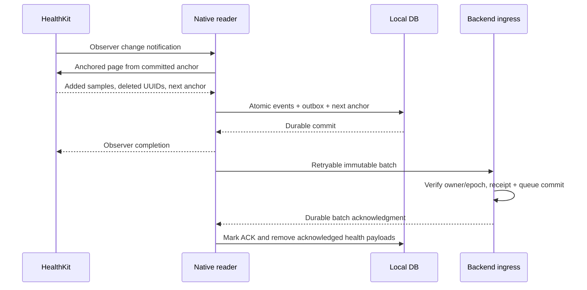

# Apple Watch and Apple Health extraction specification

**Version:** 1.0 implementation proposal. **Research checked:** 2026-10-03.

Read [the shared architecture](./README.md) first. It owns canonical schemas, backend ownership, connection states, consent, retention and product constraints. This document defines the iPhone reader and upload protocol. **Verified** describes an official API capability; **Design** describes our implementation; **Gate** requires a device test or a product/contract decision. No HealthKit app, account connection, or live extraction has been implemented or tested during this documentation work.

## 1. Integration decision and platform

**Design:** implement a native Swift HealthKit reader inside the existing `apps/mobile` Expo/React Native TypeScript application. The iPhone reads the user-authorized local HealthKit store and uploads permitted records to our backend. The backend normalizes them into the same source-preserving model as Garmin and COROS.

**Verified:** HealthKit provides a local repository of health and fitness information and granular user permission. Our web app or server cannot use a provider-style Apple cloud API to fetch this store. A watch app is unnecessary for importing existing Apple Watch recordings that have reached the paired iPhone. An app that records its own workouts is a different feature. [HealthKit overview](https://developer.apple.com/documentation/healthkit).

Expo requires a native development/production build for this custom module. Standard Expo Go does not contain it. Native observers, storage, query execution and uploading must operate without waiting for React Native JavaScript to start. Use reproducible native configuration and lifecycle integration; no permanent source changes should rely on hand-editing generated files after each prebuild. [Development builds](https://docs.expo.dev/develop/development-builds/introduction/), [Expo Modules API](https://docs.expo.dev/modules/overview/), [AppDelegate subscribers](https://docs.expo.dev/modules/appdelegate-subscribers/).

Apple data is optional in the product. Imported workouts do not update planned-session outcome, tried-type history, enjoyment or preferences. A user can explicitly associate a workout with a planned session and confirm completion. Sleep or SDNN measurements never automatically change requested duration, frequency or intensity. Follow the current [product scope](../product.md) and NestJS/Supabase ownership rules in the shared architecture.

## 2. Capabilities and permissions

| Dataset | HealthKit types / APIs | Output and restrictions |
| --- | --- | --- |
| Completed workouts | `HKObjectType.workoutType()`, `HKWorkout` | Summary sport, timing, available workout statistics; keep elapsed, timer and moving duration separate. Do not assume every workout provides all durations. |
| Sleep | `HKCategoryTypeIdentifier.sleepAnalysis` | Source category samples and derived episode views; includes stage values when recorded. No assumption of an Apple sleep score. |
| HRV | `HKQuantityTypeIdentifier.heartRateVariabilitySDNN` | SDNN values in milliseconds and source sample intervals; this is not a nightly RMSSD value. |
| Resting HR / HR | `restingHeartRate`, `heartRate` | Source quantity samples/intervals; detailed workout HR requires separate enabled detail processing. |
| Distance / energy | Relevant quantity identifiers and workout statistics | Convert explicit units; avoid reconstructing distance from GPS when source distance is absent. Different sports have different distance types. |
| Routes | `HKSeriesType.workoutRoute()`, associated route query and `HKWorkoutRouteQuery` | Separately consented enrichment, off by default; location batches and source route replacements. |
| Further workout metrics | SDK-supported sport-specific quantity types | Feature-by-feature gates, SDK/device availability checks; no blanket guarantee of power/cadence/laps for every activity. |

Sources: [HKWorkout](https://developer.apple.com/documentation/healthkit/hkworkout), [sleep categories](https://developer.apple.com/documentation/healthkit/hkcategoryvaluesleepanalysis), [HRV SDNN](https://developer.apple.com/documentation/healthkit/hkquantitytypeidentifier/heartratevariabilitysdnn), [route reads](https://developer.apple.com/documentation/healthkit/reading-route-data).

### 2.1 Native configuration

**Design:** add a local iOS Expo module, a config plugin and a native synchronization service. Suggested module location: `apps/mobile/modules/health-reader`; exact repository conventions are selected at implementation. Expose a small TypeScript interface for consent/status/foreground sync; health payload processing remains native.

- Check `HKHealthStore.isHealthDataAvailable()` and OS availability before initializing optional types. Android/web expose backend history and show that Apple on-device extraction requires an iPhone.
- Enable the HealthKit capability and `com.apple.developer.healthkit`; enable `com.apple.developer.healthkit.background-delivery` for background observer delivery.
- Supply `NSHealthShareUsageDescription` explaining selected health/fitness reads. This extraction feature requests no HealthKit write types. Add `NSHealthUpdateUsageDescription` only if a separate writing feature is introduced; do not request writes merely to test read permission.
- Configure entitlements, purpose strings, module registration and AppDelegate subscriber through reproducible configuration. Verify generated entitlements and signed device build, not just `app.json` contents.
- Register native observers in `application(_:didFinishLaunchingWithOptions:)` or its Expo subscriber equivalent. Query coordination uses a Swift actor/serial executor so concurrent callbacks cannot race an anchor.
- A watchOS companion and live-workout background mode are outside this extraction design. Do not run a fake live workout to keep an importer awake.

Apple documents usage descriptions and local data protection; background delivery has an additional entitlement and must be tested on a device. [Privacy](https://developer.apple.com/documentation/healthkit/protecting-user-privacy), [background delivery](https://developer.apple.com/documentation/healthkit/hkhealthstore/enablebackgrounddelivery%28for%3Afrequency%3Awithcompletion%3A%29).

### 2.2 Permission and upload consent

Request read types in small groups: workout summaries; sleep; HRV/resting HR; optional detailed sensors; optional route data. App consent separately controls upload to our backend and any AI use. The effective extraction set is limited to selected groups, supported types and actually readable samples.

**Verified:** read-denial status is intentionally hidden. `authorizationStatus(for:)` reports authorization to save a type, not a read-permission check. Completion of the authorization request does not prove that every read type was granted. [Authorization status](https://developer.apple.com/documentation/healthkit/hkhealthstore/authorizationstatus%28for%3A%29), [privacy](https://developer.apple.com/documentation/healthkit/protecting-user-privacy).

**Design:** store `requested_types`, prompt completion and actual query evidence. Empty queries mean `unknown` or `no_data` according to observed evidence; do not label read access `restricted` just because results are empty. A specific system restriction/error is separate evidence. The user can manage Health access in system settings. Newly readable history requires explicit bounded reconciliation; never interpret previously hidden samples as newly measured today.

Disable a dataset immediately when the user disables app upload consent: stop its observers/background registration as appropriate, discard its pending payloads, bump the backend generation and re-enroll still-enabled streams. Permission changes in Health settings may not be reliably identifiable as such. Do not infer source deletion from samples becoming unreadable.

## 3. Native and backend architecture

```mermaid
flowchart LR
    Watch[Apple Watch] --> Store[iPhone HealthKit store]
    Store --> Observer[Native observer notifications]
    Observer --> Reader[Serialized anchored readers]
    Reader --> Local[Protected local database and outbox]
    Local --> Uploader[Native authenticated uploader]
    Uploader --> Ingress[Backend batch ingress]
    Ingress --> Queue[Durable receipt and processing queue]
    Queue --> Normalizer[Apple normalization adapter]
    Normalizer --> Canonical[Shared source and canonical records]
    UI[Expo consent and status UI] --> Reader
    Canonical --> Read[Owner-scoped backend reads]
```



The backend assigns a stable HealthKit `provider_subject` dataset ID for the app user. Apple exposes no API Apple ID subject to use here. The local installation has a random `bridge_id`; it is operational metadata, not sample identity. Source records use HealthKit UUIDs plus record-kind namespace and the shared owner/dataset binding.

An Apple Health store may contain Apple Watch recordings, other watches, manual entries and third-party app copies. Store source application/device/revision provenance and do not label every sample Apple Watch data. Cloud-imported Garmin/COROS records mirrored into HealthKit remain separate source records; the shared duplicate view controls counting.

### 3.1 Local durable storage

| Local collection | Required state |
| --- | --- |
| `reader_binding` | App owner/dataset ID, bridge ID, connection/generation, elected writer epoch, enabled types, consent version. |
| `query_states` | Sample type, stable predicate definition/hash, query version, archived opaque anchor, query epoch, last successful read, pending dirty flag. |
| `sample_index` | HealthKit UUID, type/dataset/kind, source metadata, parent relationships, last emitted representation digest. No unnecessary original values. |
| `outbox_batches` | Immutable batch ID, writer epoch, stream sequence, event digests, permitted payloads/tombstones, created time, attempts and acknowledgment. |
| `detail_jobs` | Workout/route identity, bounded detail request, retry/lease, current generation and consent. |
| `sync_status` | Per-type readable coverage, unknown gaps, device/lock/network failures, last backend ACK. |

Use a transactional native store such as SQLite, with reviewed encryption/data-protection policy. Protect local health bytes and exclude the outbox from general cloud backup. Prefer protection that prevents reads while locked; accept delayed sync. Store app credentials in the Keychain and use the existing app auth mechanism through a native-accessible token service. Do not relax protection merely to increase background throughput.

There are two independent acknowledgments: HealthKit anchor advancement after durable local handling, and server acknowledgment after durable backend ingestion. Neither substitutes for the other.

## 4. Query and outbox algorithm

### 4.1 Observer plus anchored reader

**Verified:** observer queries notify that matching samples changed. Anchored queries retrieve additions and deleted objects and return an opaque next anchor. Observer delivery can wake the app; an anchored query alone is not a background-delivery registration. [Reading data](https://developer.apple.com/documentation/healthkit/reading-data-from-healthkit), [anchored query](https://developer.apple.com/documentation/healthkit/hkanchoredobjectquery).

**Design:** for every enabled sample type:

1. On native startup, restore its fixed query definition/anchor, create its observer, and register the supported background delivery frequency. Requested `.immediate` is a maximum preference, not an exact delivery promise.
2. On notification, set a durable dirty flag and schedule a serialized drain for that query. Multiple callbacks coalesce; every completion handler must be resolved once.
3. Run a bounded anchored query with the previously committed anchor. Proposed page size: 500 simple samples; shrink for expensive types. Never use an unlimited query for dense heart-rate history.
4. On successful results, convert readable selected fields into source upserts and map deletions into tombstones. If the same UUID is both added and deleted in a result page, deletion wins for that page; preserve evidence and test SDK behavior.
5. In **one local transaction**, persist permitted events and a stable immutable outbox batch, update the sample index, assign its stream sequence, commit the returned anchor, and update dirty/query status.
6. Only after local durable handling, invoke the observer completion handler. Network success is not required before that handler; the outbox owns delivery. If work must be deferred for lock/time/storage failure, retain a durable dirty/recovery flag when possible, leave the anchor unchanged, resolve the handler within the app's execution budget, and recover on foreground/unlock.
7. Continue from the new anchor while pages may remain, subject to the current execution budget. If interrupted, the next attempt resumes from the last durable anchor/page.
8. Trigger upload opportunistically. When offline or unable to access protected credentials/data, leave the outbox pending and retry at the next permitted execution opportunity.

Observer completion must not be forgotten or held open for a large history import. Apple describes retry/backoff and eventual stopping when completion is repeatedly omitted. [Background delivery](https://developer.apple.com/documentation/healthkit/hkhealthstore/enablebackgrounddelivery%28for%3Afrequency%3Awithcompletion%3A%29).



### 4.2 Stable predicates and backfill

An anchor belongs to a sample type, fixed predicate, local reader/query epoch and query version. Archive it through supported secure coding; it is not a timestamp or offset to compare. Never reuse an anchor while sliding a date predicate forward every day.

**Design:** use a fixed earliest-import cutoff for each incremental stream: initially up to 90 days for workouts and 30 days for sleep/HRV, bounded by requested consent and readable history. A small last-seven-day snapshot query can populate the UI first; the separate anchored stream starts from its own nil anchor and reads in bounded batches. Duplicate sample UUIDs make overlap safe. The first anchored pass does not promise newest-first ordering.

Each query definition specifies overlap semantics for interval samples. Sleep/workouts crossing a cutoff are included by an interval-overlap policy, not a strict-start-only filter. Preserve complete source intervals and use user-view filtering separately. Track the initially requested cutoff, complete readable query coverage and canonical retention boundary.

Changing type/filter/consent/history depth creates a new query version with its own anchor, bounded backfill and overlap deduplication. A nil-anchor query may expose only currently readable records and retained recent tombstones; it does not prove a complete deletion history. Read anchors and outbox remain valid independently of network availability.

Proposed reconciliation: on each app foreground and after an authorization prompt, drain all enabled incremental streams; re-query a bounded recent seven-day snapshot for revisable workout details and newly readable samples. Do not turn missing snapshot records into deletes. Extend history only after user request and query-cost verification. Skip older expired records instead of refilling data past retention.

### 4.3 Crash and storage recovery

| Failure point | Recovery |
| --- | --- |
| Before local transaction | Anchor unchanged; page replay is safe. |
| During event/anchor transaction | All-or-nothing rollback; no advanced anchor with lost payloads. |
| After local commit before upload | Outbox survives; retry immutable batch. |
| After backend acceptance but before receipt reaches phone | Retry same batch ID/digest; backend returns prior ACK. |
| Local storage full or encryption key unavailable | Stop advancing anchors, retain failure/dirty state, inform user on foreground; do not drop samples to claim success. |
| Outbox retention limit reached | Pause drain or deliberately reset/reconcile an affected query after recording gap; never silently evict unacknowledged events while keeping an advanced anchor. |
| Anchor archive invalid after migration/store reset | Create a new query epoch and bounded rescan; mark deletion coverage uncertain until reconciled. |

**Design:** pending local health payload retention is seven days, configurable. If it expires, record a gap and remove sensitive bytes. Before discarding an assigned unacknowledged sequence, perform a fenced backend stream reset with a new reader epoch (or mark reset required until reachable), then perform bounded rescan; otherwise the backend would wait forever for the missing sequence. Resetting transport epoch does not clear sample tombstones or change source dataset identity. Because HealthKit deleted objects can disappear, rescan can recover readable upserts but cannot promise recovery of all missed tombstones. Expose unknown deletion coverage and provide explicit backend-history purge/reimport if the user needs a clean reset.

## 5. Upload protocol and writer ownership

### 5.1 Proposed application endpoints

| Route | Behavior |
| --- | --- |
| `POST /v1/apple-health/readers` | Authenticate app user, enroll/re-enroll bridge to backend-owned dataset, return connection/generation and elected writer epoch. |
| `POST /v1/apple-health/batches` | Accept immutable bounded source events/tombstones from the elected native reader. |
| `GET /v1/source-connections` | Return shared state and per-dataset coverage/status, not a guessed read-permission status. |
| `PATCH /v1/source-connections/{id}/consent` | Fence disabled datasets and issue a reviewed binding for remaining streams. |
| `DELETE /v1/source-connections/{id}` | Stop uploads/ingestion immediately and queue optional history deletion. |

These are our endpoints. Device auth is app auth, not an Apple provider bearer token. Authenticate the session, resolve connection to owner, compare generation/reader epoch, validate dataset consent and parse each record under the accepted schema. Ignore or reject client ownership claims. Native upload must pause if app credentials expire; queued data is never sent under another user's session after logout.

### 5.2 Writer election and ordering

**Design:** one installation is the elected ingestion reader for an app user's HealthKit dataset. Enrollment of another phone does not automatically take ownership. An explicit user-approved takeover advances `reader_epoch`, fences the old writer and begins bounded reconciliation on the new phone. Query execution leases serialize reads locally; backend writer designation remains until transfer/disconnect, so iOS suspension does not silently elect a second device.

Use a monotonic `batch_sequence` for the elected writer's `stream_id: apple_health_source`. Every successful local page transaction assigns the next sequence while persisting its immutable batch. Upload oldest unacknowledged sequence first. Server receipts can acknowledge duplicates, but later sequence application waits for gaps to avoid stale upsert/delete ordering. Backend `accepted_sequence` and `applied_sequence` are separate if normalization is asynchronous.

When a batch has an oversized page, split it into ordered immutable sub-batches before committing the anchor; all page events must be persisted locally atomically. Do not change an already assigned batch's content after retry. A writer/consent reset starts a new epoch instead of skipping missing sequences silently.

Health stores on different phones may have different readable contents. Takeover does not make missing data on the new phone an authoritative deletion. UUID consistency across actual synced devices, store reset behavior and ownership of shared/family-device data are device-test gates. Bridge IDs cannot serve as the canonical UUID namespace, or the same synced sample would duplicate on takeover.

### 5.3 Batch wire example

This is a **proposed internal app wire format**, not an Apple API response. The backend adapter translates it into the shared `SourceEventV1`; `ingest_event_id` is derived from stable batch ID plus event index. The phone never sets `user_id`, `provider_subject`, or arbitrary `raw_object_ref`.

```json
{
  "schema_version": "1.0",
  "connection_id": "example-connection",
  "connection_generation": 4,
  "bridge_id": "example-installation",
  "reader_epoch": 2,
  "stream_id": "apple_health_source",
  "batch_sequence": 17,
  "batch_id": "example-immutable-batch",
  "created_at": "2026-10-03T08:00:00Z",
  "events": [
    {
      "operation": "upsert",
      "dataset": "observations",
      "external_id": "observation:example-healthkit-uuid",
      "query_version": "hrv-sdnn-v1",
      "observed_at": "2026-10-03T07:59:50Z",
      "payload": {
        "kind": "observation",
        "metric": "hrv",
        "value": 42.1,
        "unit": "ms",
        "method": "sdnn",
        "aggregation": "source_sample",
        "start_at": "2026-10-03T05:10:00Z",
        "end_at": "2026-10-03T05:11:00Z",
        "source_local_date": null,
        "source_timezone": null,
        "source_utc_offset_seconds": null,
        "availability": "available",
        "provenance": {
          "adapter_version": "apple-health-v1",
          "transform_version": "observation-v1",
          "import_mode": "native_healthkit",
          "source_identifiers": {"sample_uuid": "example-healthkit-uuid"},
          "timezone_origin": "unknown"
        }
      }
    }
  ]
}
```

Proposed limits follow the shared spec: 500 simple events, 1 MB compressed and 5 MB expanded JSON. Optional detail is chunked separately; gzip/decompression limits apply before parsing. Response acknowledgment includes `batch_id`, accepted generation/epoch, immutable digest, `accepted_sequence`, status and processing receipt/job ID. A duplicate with the same digest gets the original ACK; a changed digest gets `409`. Stale generation/epoch returns `410` with safe re-enrollment instructions. Invalid/oversized batches receive structured errors and never silently advance sequence.

Backend ingress stores the whole accepted batch and queue entry durably before returning ACK. Parser quarantine is a visible processing status; it is not a false successful coverage claim. A schema error found before acceptance rejects the batch, and the native reader must repair/reset the stream explicitly rather than keep retrying forever. Acknowledged local payloads are removed promptly; minimal batch metadata can remain for recovery.

## 6. Dataset mapping and detail consistency

### 6.1 Workouts

Use workout UUID as stable source identity; preserve original sport, source application/device and source metadata needed for identity. Map the source sport to a normalized sport through a versioned table; unknown sports remain unknown rather than being relabelled as beginner walking. App categories are optional display metadata and cannot establish tried-type state.

Map start/end, explicit duration/statistics, and available distance/energy/HR. Do not derive moving time from `end - start` or blindly equate an elapsed interval to timer duration. Preserve the HealthKit-reported duration in labelled source metadata until its mapping is verified for pauses and multi-activity workouts. Inspect associated quantity samples/statistics with workout predicates, not a broad time-window join that attaches unrelated concurrent readings. [HKWorkout](https://developer.apple.com/documentation/healthkit/hkworkout).

**Design:** save a valid summary first and enqueue optional enrichment. Associated sensors or routes can sync later; missing first-pass detail is `unknown`/partial. Retry on related type notifications, foreground reconciliation and a bounded detail job. Do not claim a complete high-resolution sensor series unless source sampling/coverage is known. Laps, segments and multi-activity structure need verified SDK mapping; HealthKit events are not automatically equivalent to FIT laps.

### 6.2 Sleep

| HealthKit category | Canonical stage |
| --- | --- |
| `inBed` | `in_bed` |
| `awake` | `awake` |
| `asleepCore` | `light`, with original `asleepCore` retained |
| `asleepDeep` | `deep` |
| `asleepREM` | `rem` |
| `asleepUnspecified` / older generic asleep | `asleep_unspecified` |
| Unrecognized future category | `unknown`, preserve code |

**Verified:** in-bed samples can overlap stage samples; Apple Watch awake samples do not necessarily cover the beginning/end of an in-bed interval. Therefore an incomplete edge is not inferred to be awake or asleep. [Sleep analysis](https://developer.apple.com/documentation/healthkit/hkcategoryvaluesleepanalysis).

**Design:** preserve category-sample UUIDs as source sleep segments. Derive episode views deterministically from the selected source stream and interval-union rules in the main document. Apple category samples need not carry a stable night/session ID; do not invent a permanent source night keyed only by calendar date. Derived episode IDs/versioned membership are application outputs and may change when a later sample joins/splits an episode.

Use provided episode/nap metadata when reliable. Otherwise episode classification and grouping thresholds remain explicit versioned view policy; first MVP can display source segments and daily selected asleep totals with `episode_type: unknown` instead of an unsupported night/nap claim. An in-bed duration is never added to staged asleep duration. Source-stream conflicts stay visible; do not merge AutoSleep, Apple Watch and another tracker into one fabricated hypnogram.

### 6.3 HRV and resting HR

Store every readable HRV sample as `method: sdnn`, value in milliseconds, original interval, source/device, and available algorithm metadata. Apple Watch records SDNN samples automatically, but this does not promise continuous overnight recordings or a sample for every night. Preserve sparse measurements; missing is not zero. [SDNN](https://developer.apple.com/documentation/healthkit/hkquantitytypeidentifier/heartratevariabilitysdnn).

A source sample is not itself an overnight summary. If a future feature derives a daily/overnight aggregate, require an explicit aggregation method, sampling count, selected source, overlap window and completeness marker. Keep it distinct from provider-native overnight values. Optional heartbeat-series extraction and calculation of other HRV methods require a separate research/quality feature; ordinary heart-rate samples cannot reconstruct beat-to-beat intervals.

Resting HR is its own source metric. Keep source meaning and measurement interval; do not estimate it from a workout minimum. Native HR samples retain actual sampling times, with no artificial second-by-second interpolation.

### 6.4 Routes and sensitive metadata

Routes are off by default. When explicitly enabled, identify associated route objects, then read location data in bounded `HKWorkoutRouteQuery` batches. Track completion and route sample UUID/version; replacement/smoothing can produce updated route objects. Partial results are not a complete GPS route. [Reading route data](https://developer.apple.com/documentation/healthkit/reading-route-data).

Persist only selected coordinates/accuracy/timing fields under precise-location consent. No location-based enrichment should fetch an unconsented route. Source metadata/free-text notes may contain more information than required; allowlist identity/time/measurement metadata before the local outbox and backend source storage. Server-side filtering is a second boundary, not permission to store broad payloads on the phone first.

## 7. Deletion, permission loss and disconnect

**Verified:** `HKDeletedObject` contains a UUID and possibly metadata, not a full copy of the deleted sample. Deleted objects are temporary and may be removed from the local HealthKit store. [Deleted objects](https://developer.apple.com/documentation/healthkit/hkdeletedobject).

**Design:** retain a minimal UUID-to-type/parent index and use the query's type to map tombstones even when the original local payload was discarded. Upload ordered deletes through the same outbox as additions. If a delete references an unknown UUID, record a minimal tombstone in the appropriate namespace; do not fetch the deleted sample or infer its values. Backend parent/sample relationships invalidate derived sleep episodes, workouts/details or aggregate dependencies appropriately.

Backend tombstones are monotonic in the elected writer stream and retained by sample UUID across writer/query epochs. Applying sequence 20's deletion prevents sequence 19's delayed upsert from resurrection. A takeover/reinstalled reader's stale snapshot cannot resurrect that deleted UUID in a later epoch. Legitimate sample replacement with a new UUID is a different source record; source deletion suppression is reset only by an explicit owner-approved purge/reset to a new HealthKit dataset identity, with bounded reimport. Snapshot absence, app uninstall, or unreadable permissions never generates a source deletion.

Uninstall/reinstall, anchor corruption, prolonged offline periods, data-store changes and reader takeover can lose deletion evidence. A new nil-anchor snapshot cannot guarantee old deletions are recovered. Mark deletion coverage `unknown`, preserve existing retained-history provenance, and offer a user-selected purge/reimport for a definitive local-backend reset. Do not advertise an exact complete Apple Health mirror across those gaps.

On app logout/disconnect: disable native observers/delivery for disabled streams, stop readers/uploads, clear owner-specific pending payloads and accessible credentials, and invoke the shared backend generation fence. Keep only explicitly retained local metadata; another user cannot inherit pending health uploads. Backend disconnect with retained history allows owner reads with disconnected provenance; delete selection purges raw/canonical/derived/AI copies under shared retention and backup policy.

App disconnect does not programmatically claim revocation of Health settings read permission. Explain the distinction in the connection UI and give accurate settings guidance. On reconnect, require app consent/enrollment and bounded rescan; apply the new generation without allowing old pending batches to reuse it. HealthKit authorization stays independently controlled by the user.

## 8. Automatic timing and failure behavior

**Verified:** HealthKit reads may fail while the device is locked because the store is protected. Background delivery frequency is system-controlled, and some types have bounded delivery frequencies. Background behavior requires a physical-device test. [Privacy/data protection](https://developer.apple.com/documentation/healthkit/protecting-user-privacy), [database inaccessible](https://developer.apple.com/documentation/healthkit/hkerror/errordatabaseinaccessible), [background delivery](https://developer.apple.com/documentation/healthkit/hkhealthstore/enablebackgrounddelivery%28for%3Afrequency%3Awithcompletion%3A%29).

**Design:** promise eventual sync with native observer attempts and foreground catch-up. Watch-to-phone delay, a locked/unreachable phone, disabled background refresh, low-power scheduling and force quitting can all affect opportunity to run; measure the supported OS/device behavior rather than promising a timer SLA. Never implement a JavaScript interval as the synchronization guarantee. Background URLSession can transport already permitted durable bytes if suitable, but cannot unlock HealthKit or grant read access.

| Condition | Handling |
| --- | --- |
| `errorDatabaseInaccessible` / protected local store unavailable | Keep anchor unchanged, record pending work; retry when executable/unlocked/foreground. |
| Empty successful query | Availability unknown/no readable records; no false read-denial or source deletes. |
| App session expired | Pause upload; app reauthentication required. HealthKit permission remains separate. |
| Network/5xx | Shared retry policy when execution is available: 30 seconds to six hours with jitter, max eight attempts before attention; native scheduling can defer wall-clock execution. |
| 429 | Honor backend retry instructions; keep immutable batches queued. |
| Stale generation/reader epoch | Stop old stream, discard/fence its sensitive pending bytes under policy; explicitly re-enroll and reconcile. |
| Schema rejection/oversized batch | Repair with a versioned/reset stream and bounded re-extraction; never silently skip a sequence or mutate a previously accepted batch. |
| Related workout detail not yet present | Retain summary, mark partial, retry bounded enrichment. |
| Deleted-object history no longer available | Mark deletion coverage uncertain; do not claim exact mirroring. |

Connection status displays last reader contact, last local successful query, last backend ACK, latest measurement and readable coverage separately. Proposed foreground target is useful recent summaries within 60 seconds on a healthy unlocked device/network with modest history. Background latency has no fixed service promise. Report iOS causes as observed states, avoiding a false diagnosis of denied permission.

## 9. Prototype with Health Auto Export

Before native implementation, a consenting team member can configure [Health Auto Export](https://www.healthyapps.dev/apps/health-auto-export/) to POST JSON health/workout data to an authenticated export-bridge ingress. Its [REST automation guide](https://help.healthyapps.dev/en/health-auto-export/automations/rest-api/) documents selected metrics/workouts and background limitations. Its [local MCP server](https://help.healthyapps.dev/en/health-auto-export/automations/server-connection/) is an interactive local-network option that recommends foreground use.

**Design:** enroll a backend-owned bridge connection, give it an owner-bound narrowly scoped upload credential, and normalize only verified export fields with `import_mode: export_bridge`. This is a different input contract from native anchored batches. Do not claim HealthKit UUID identity, authoritative tombstones, exact automatic intervals, or all workout detail when the export does not provide them. Health Auto Export JSON schemas and identity/aggregation behavior require sample validation before reuse.

Use one phone/account for a demo, explicitly choose sleep/HRV/workout exports and test their timestamps/units/overlap. Prefer JSON for nested source information. App-specific export headers are transport metadata; they are not source identity or proof of record deletion. A manual Apple Health archive can be a separate bounded importer, but it is not the automatic native path and broad archives must be filtered to consent.

The prototype validates backend normalization and UI context; it does not validate native background delivery, anchor correctness or deletion synchronization. An official Apple cloud MCP is not an established dependency here. Do not expose the phone's unauthenticated local TCP server publicly as a cloud integration.

## 10. Verification and release gates

### 10.1 Required acceptance cases

| Scenario | Expected result |
| --- | --- |
| Signed device build/config plugin regeneration | Entitlements and purpose strings retained; module/lifecycle handler loads without JS. |
| Deny one/all read types or answer only some | No guessed granted/restricted flag; selected app consent and query evidence shown honestly. |
| Lock/unlock, low power, app killed/force quit, delayed Watch sync | Pending work survives where possible; foreground catch-up imports without promising fixed background latency. |
| Crash before/after anchor-outbox commit | No anchor advances without durable added/deleted events. |
| Offline for several days then upload | Immutable batches replay in order, one canonical identity per sample. |
| Lost backend ACK or reordered retry | Duplicate ACK, digest collision rejected, later applied sequence waits for gaps. |
| Source deletion before upload / after upload | Tombstone ordering wins; relevant derived views/details removed. |
| Deleted UUID lacks original local payload | Type/parent mapping or appropriate namespace tombstone; no invented measurement. |
| Long gap/reinstall invalidates anchors/deletion evidence | Bounded rescan and unknown deletion coverage; no delete-from-absence. |
| Workout summary precedes samples/route | Summary usable; enrichment later, partial detail clearly reported. |
| Apple + third-party overlapping sleep stages | Selected-source union; in-bed not added; inconsistent stage coverage not fabricated. |
| HRV sample method vs other brand's overnight value | SDNN/window/source retained; no interchangeable pooled score. |
| DST/cross-midnight/travel with missing timezone metadata | UTC duration correct, assumption provenance explicit, unknown zone preserved. |
| Second reader / explicit takeover | Old epoch rejected; no namespace duplication, no deletion inferred from different store visibility. |
| Logout/user switch/consent reduction during query/upload | Owner/generation fence prevents old data reaching new account; pending fields purged appropriately. |
| Route consent absent / broad metadata present | No unconsented location/metadata in local storage, backend, quarantine or AI input. |
| Imported workout overlaps app plan | No automatic completion, enjoyment, tried-type or preference change. |

Run query/parser/outbox tests on synthetic records plus a small physical iPhone/Watch test matrix. The simulator can test interface/normalization logic but does not prove background HealthKit operation. Capture sanitized fixtures only from consenting accounts; no identifiable exports enter Git.

### 10.2 Implementation gates

1. Choose/pin the HealthKit native module and minimum iOS build target compatible with the current Expo SDK; verify Swift/native lifecycle support.
2. Confirm distribution/signing/capability setup and a physical Apple Watch+iPhone test account.
3. Establish native app-session token access, protected database policy and acceptable pending-outbox retention.
4. Prove per-type fixed predicates, finite anchor paging, archive migration, interval-overlap semantics and deleted UUID behavior.
5. Validate actual workout durations/statistics, source provenance and optional metric/route support for intended devices.
6. Decide episode grouping/classification and source selection policy; keep unverified sleep episodes unknown.
7. Implement owner-bound elected writer/epoch, immutable ordered batches, durable ACK and generation reset protocol.
8. Demonstrate disconnect/purge across device, backend, files, derived context and backup deletion policy.
9. Review the actual HealthKit usage/sharing requirements, app privacy disclosure and AI-purpose consent before distribution. This spec is a data-flow design, not approval of downstream use.

### 10.3 Delivery checklist

- [ ] Local Expo Swift module/config plugin/lifecycle subscriber implemented and signed.
- [ ] Fine-grained read/upload consent and truthful permission UI implemented.
- [ ] Anchor + sample index + outbox transaction tested under crashes.
- [ ] Bounded recent snapshot, anchored backfill and reconciliation added.
- [ ] Native authenticated upload/elected reader ordering verified.
- [ ] Canonical source mappings, stage union and detail enrichment verified.
- [ ] Tombstones, gap visibility, logout/reset and purge behavior tested.
- [ ] Physical-device background/lock/offline tests completed.
- [ ] Expo Android/web gracefully expose backend history without on-device Apple extraction.
- [ ] Product planning/feedback invariants verified.

## 11. Source register

Official documentation was consulted on **2026-10-03**; API availability and device behavior must be revalidated at implementation. Provider capability statements above come from these sources; all schedules, local storage choices, wire fields and election rules are proposed app design.

| Primary source | Used for |
| --- | --- |
| [HealthKit](https://developer.apple.com/documentation/healthkit) | Local store and permission model. |
| [Reading HealthKit data](https://developer.apple.com/documentation/healthkit/reading-data-from-healthkit) | Observer versus anchored query responsibilities. |
| [Anchored object queries](https://developer.apple.com/documentation/healthkit/hkanchoredobjectquery) | Added/deleted samples and opaque anchors. |
| [Deleted objects](https://developer.apple.com/documentation/healthkit/hkdeletedobject) | UUID tombstones and temporary deletion history. |
| [Background delivery](https://developer.apple.com/documentation/healthkit/hkhealthstore/enablebackgrounddelivery%28for%3Afrequency%3Awithcompletion%3A%29) | Entitlement, startup observers, completion and frequency limits. |
| [Authorization status](https://developer.apple.com/documentation/healthkit/hkhealthstore/authorizationstatus%28for%3A%29) | Read-denial ambiguity versus write status. |
| [Privacy](https://developer.apple.com/documentation/healthkit/protecting-user-privacy) | Usage descriptions, lock protection and disclosure requirements. |
| [Locked database error](https://developer.apple.com/documentation/healthkit/hkerror/errordatabaseinaccessible) | Recoverable protected-store access failure. |
| [Workout samples](https://developer.apple.com/documentation/healthkit/hkworkout) | Summary and associated sample/statistics model. |
| [Sleep categories](https://developer.apple.com/documentation/healthkit/hkcategoryvaluesleepanalysis) | Overlapping in-bed/stage samples and awake edge gaps. |
| [SDNN HRV](https://developer.apple.com/documentation/healthkit/hkquantitytypeidentifier/heartratevariabilitysdnn) | HRV method, time unit and Apple Watch sampling. |
| [Reading routes](https://developer.apple.com/documentation/healthkit/reading-route-data) | Associated route samples, replacements and batched location reads. |
| [Expo development builds](https://docs.expo.dev/develop/development-builds/introduction/) | Custom native functionality and build workflow. |
| [Expo Modules API](https://docs.expo.dev/modules/overview/) | Swift native module integration. |
| [Expo AppDelegate subscribers](https://docs.expo.dev/modules/appdelegate-subscribers/) | Native app lifecycle independent of JS. |
| [Health Auto Export REST](https://help.healthyapps.dev/en/health-auto-export/automations/rest-api/) | Separate prototype export input and background limits. |
| [Health Auto Export MCP](https://help.healthyapps.dev/en/health-auto-export/automations/server-connection/) | Optional foreground/local-network interactive access. |
