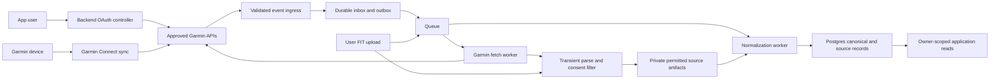
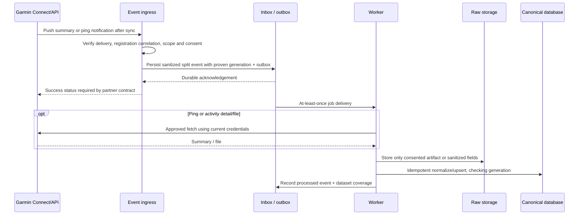

# Garmin extraction specification

Status: architecture proposal for later implementation. Research checked on **2026-10-03**. No Garmin account, partner application, or integration was connected during this work.

Read the [shared architecture](README.md) first. It owns the canonical model, backend API conventions, storage, retention, security, and product boundaries. This document specifies the Garmin adapter and its launch gates. **Verified** means supported by the linked public Garmin material. **Design** means a choice for this application. **Gate** means the current partner documentation or an evaluation account must resolve the detail before production implementation.

## 1. Decision and scope

**Design:** use Garmin Connect **Health API plus Activity API** as the production source. Prefer push delivery for authorized summary datasets and ping/pull for notifications whose referenced payload or file must be downloaded; confirm which combinations Garmin permits for the approved application. Use one shared ingestion pipeline for both. Event delivery depends on the user syncing their device to Garmin Connect; the app cannot guarantee delivery while the watch or phone is offline.

**Verified:** Health API supplies health summaries; Activity API supplies completed activity data. Training API publishes planned workouts and training plans to Garmin. Training API is outside this extraction implementation. [Program overview](https://developer.garmin.com/gc-developer-program/)

Deliver in two independently usable stages:

1. **File-based demo:** user uploads original activity FIT files; optionally add a separately tested wellness FIT import. This stage requires no cloud credentials and provides no automatic sync.
2. **Approved cloud integration:** connect accounts, ingest authorized workouts and sleep automatically, then enable optional HRV/recovery metrics only after verifying their field definitions and access.

Imported movement remains an external observation. It cannot set an app session to `done`, establish that a card/type was tried, or infer enjoyment. Linking an import to a planned session requires an explicit user action. HRV, stress, sleep, and Body Battery must not increase prescribed duration, frequency, or intensity. The planner continues to follow the current [product scope](../product.md) and the user’s explicit preferences.

## 2. Capability and access matrix

| Dataset | Publicly verified capability | Adapter output / minimum launch proof |
| --- | --- | --- |
| Workouts | Activity API; FIT, TCX, GPX details; push or ping/pull; evaluation after approval. | `workouts`, optional `observations`, laps and raw file. Prove summary ID and file association, elapsed versus moving duration, units, indoor/no-GPS activity, and revisions. |
| Sleep | Health API lists sleep and JSON health summaries. | `sleep_sessions` and `sleep_segments` where supplied. Prove intervals, stages, naps, date attribution, corrections, and supported device behavior. |
| Daily movement | Health API lists steps, intensity minutes, calories. | `daily_summaries`; keep summary totals distinct from workout totals. Prove source date and offset semantics. |
| Heart rate | Health API includes HR, including second-level HR during activities. | `observations` and selected summary values. Confirm resting HR definition, frequency, quality, and source field mapping. |
| Stress / Body Battery / respiration / Pulse Ox | Health API lists these metrics. | Optional provider-specific observations/summaries; disabled by default unless needed and granted. Preserve vendor meanings. |
| HRV summary/status | Public Health API landing page does not define a general nightly HRV summary schema. | `unknown` until entitled reference and sample data prove metric, algorithm/window, units, device support, and history. Do not promise nightly RMSSD or HRV Status from landing-page capability alone. |
| Enhanced beat-to-beat interval | Garmin describes enhanced BBI for Garmin Health customers through Health API/Standard SDK. | Separate optional entitlement. It is a beat series, not an interchangeable nightly HRV score. Confirm license, device support, confidence flags, extraction and retention needs. |
| Historical import | Health and Activity pages advertise backfill tools. | Configurable bounded backfill, only after confirming per-dataset limits and delivery behavior. No assumed unlimited history. |
| Deletion / consent changes | OAuth specification defines registration deletion and permission-change notification. | Required control-event handling and current-permission checks; detailed event payload/validation is a gate. |
| MCP | No vendor-supported Garmin MCP was identified in the public official developer material reviewed. | Use the approved API. Community MCPs/unofficial Connect clients are excluded from production architecture. |

Sources: [Activity API](https://developer.garmin.com/gc-developer-program/activity-api/), [Health API](https://developer.garmin.com/gc-developer-program/health-api/), [enhanced BBI announcement](https://www.garmin.com/en-US/newsroom/press-release/wearables-health/2023-garmin-health-summit-celebrates-smartwatch-enabled-digital-health-solutions/). The matrix lists opportunities, not a guarantee that every watch records every field or every partner can receive it.

**Verified access:** the program is for business use. Its FAQ distinguishes free program access from commercial metric fees/minimum device quantities and describes approval plus evaluation. The published typical integration estimate is 1–4 weeks; it is not a delivery commitment. Current pages display a program update notice. New-application availability and commercial terms must be confirmed directly; this specification does not assert that applications are officially paused. [Program FAQ](https://developer.garmin.com/gc-developer-program/program-faq/)

## 3. Partner discovery gates

Create a dated `garmin-provider-contract` implementation record inside the project when access is approved. Record reference version, approved application/environment, answers below, and sanitized evaluation evidence. Store secrets only in the server secret store.

| Gate | Required answer/evidence |
| --- | --- |
| G1: eligibility and entitlements | Approval path is open; Health and Activity enabled; pricing and permitted retention/use accepted; separate BBI entitlement if requested. |
| G2: dataset schema | Current authoritative summary types, field definitions, nullable/optional values, source IDs, update/delete semantics, device differences, source time zone/offset, HRV definition. |
| G3: event contract | Push/ping schemas, per-message batching, permission and deregistration events, delivery authentication, key rotation, timeout, retries, duplicate behavior and maximum payload. |
| G4: fetching | Current data/file endpoints, permitted callback hosts/path prefixes, URL expiry, redirect policy, authorization requirements and MIME types. |
| G5: history | Per-dataset oldest reachable time, maximum request span, time axis (measurement versus upload time), backfill delivery/completion signal, pagination and request budget. |
| G6: quotas | App/account quotas, response headers, rate-limit errors, documented retry behavior and whether backfill shares the live budget. |
| G7: auth edge cases | Actual expiry fields, revocation/deregistration semantics, permission-change behavior, allowed redirect URIs and current token endpoint requirements. |
| G8: revisions | Stable summary/activity IDs; monotonic source update/version if available; how edited/deleted records and replacement sleep summaries arrive. |

Do not invent Garmin endpoint paths, webhook HMAC headers, signatures, hard-coded rate limits, historical windows, or summary JSON field names to fill these gates. Cloud production is blocked until G1–G8 are recorded. HRV can remain disabled while verified workouts/sleep launch.

## 4. Backend topology and ownership



**Design:** Garmin credentials and all cloud API requests stay on the backend. The web/mobile client receives application connection status and owner-scoped normalized records; it does not receive Garmin tokens or callback URLs. OAuth uses the user's browser for Garmin login/consent. No watch app or Connect IQ app is required for this cloud design.

The Garmin adapter implements these semantic responsibilities, with actual HTTP paths/schemas supplied by the approved provider contract:

| Responsibility | Output / invariant |
| --- | --- |
| Authorization and registration | Bound connection, provider subject, permissions and encrypted token version; persisted states follow the shared enum. |
| Event verification and parsing | Authorized, consent-sanitized source-shaped records/control events; reject untrusted deliveries and resolve registration/generation correlation before accepting data. |
| Summary/file fetch | Permitted private artifact or sanitized extracted fields, checksum, fetch provenance, MIME and size validation; never retain a full FIT outside explicit file/data consent. |
| Backfill/reconciliation | Bounded jobs and explicit coverage state; no fabricated records for quiet days. |
| Normalize | Workouts, sleep sessions/segments, observations and daily summaries with schema version and field availability. |
| Delete/disconnect | Immediate generation fencing, provider deregistration, queued purge and stale-event suppression. |

Keep transport handling separate from normalization. A later switch between approved push and ping/pull must not change canonical record identities or the app read model.

## 5. Connection and authorization lifecycle

### Verified OAuth contract

Garmin's public [OAuth2 PKCE specification](https://developerportal.garmin.com/sites/default/files/OAuth2PKCE.pdf) defines S256 authorization-code exchange, a fixed OAuth scope, user-selectable permissions, rotating refresh tokens, persistent API user IDs, permission-change notifications, and registration deletion. Its example uses `HEALTH_EXPORT` / `ACTIVITY_EXPORT`; enable only extraction permissions.

| Operation | Publicly documented URL |
| --- | --- |
| Authorize | `https://connect.garmin.com/oauth2Confirm` |
| Token exchange/refresh | `https://connectapi.garmin.com/di-oauth2-service/oauth/token` |
| Read subject | `GET https://apis.garmin.com/wellness-api/rest/user/id` |
| Read permissions | `GET https://apis.garmin.com/wellness-api/rest/user/permissions` |
| Deregister | `DELETE https://apis.garmin.com/wellness-api/rest/user/registration` |

The PDF has inconsistent token-lifetime prose/example. Use returned expiry values, with an early-refresh margin; verify actual behavior during onboarding. Do not hard-code one day or three months. See the linked reference for exact form parameters. Confirm these URLs against the current entitled reference before implementation.

### Application design

1. Authenticated user starts connection. Create a short-lived, single-use attempt bound to user, approved environment, redirect URI, random `state`, encrypted PKCE verifier, and expiry. Use an explicit server-registered redirect URI and S256.
2. Backend constructs the authorization redirect. The application requires state even if the vendor example treats it as optional.
3. Callback verifies state, expiry, logged-in user and single-use status before exchanging the code. A denial produces a disconnected state with no ingestion job.
4. Read provider subject and actual permissions. Never attach an account based on email/display name. Missing workout or health permission yields a partially connected state with affected datasets `restricted`.
5. Atomically commit the encrypted credentials, provider subject, accepted permissions, consent time and connection generation; only then enqueue initial synchronization.
6. For one local user, reject accidentally creating two active Garmin connections for the same approved app and subject. Relinking a retained account reuses the stable source identity; a new generation fences old work.
7. Never silently merge a Garmin subject attached to another local user. Require an application account conflict resolution path, without revealing that other user's identity.
8. On permission loss, stop the affected job classes immediately and fence pending affected writes. Apply the shared consent/removal policy to the corresponding stored datasets; do not fetch restricted data to refresh an old cache.

Persist exactly the shared states: `pending_authorization | active | reauth_required | suspended | disconnecting | disconnected`. The UI may display “connecting,” “partially connected,” “syncing,” or “degraded” using pending jobs, capabilities and per-dataset flags while the persisted connection remains in its appropriate shared state. `suspended` is a deliberate operational pause, not a transient provider failure. Coverage/freshness are per dataset; a successful OAuth callback is not proof of imported history.

### Refresh rotation and concurrency

**Design:** store an encrypted token bundle plus `token_version` and returned expiry timestamps. Refresh at most once per connection using a short lease/row lock. Do not hold a database transaction open across network calls; reserve refresh ownership, make the request, then compare-and-swap the bundle/version in a new transaction. Waiting workers reread the winner's bundle.

Use only the most recently committed refresh token. Commit both returned tokens atomically before releasing the lease. Check generation/state before refresh and before commit. A refresh result from a disconnected generation is discarded. If a token was consumed but the worker crashed before persist, treat a subsequent invalid-grant result as `reauth_required`; do not loop using old secrets. Unknown refresh outcomes are investigated through a bounded retry policy, not parallel refresh requests.

## 6. Automatic ingestion lifecycle



### Ingress validation

**Gate:** public landing pages describe delivery modes but do not specify delivery authentication/signatures. Implement the approved verification scheme exactly; prove it with evaluation fixtures before accepting production data. Do not advertise HMAC signing or IP allowlisting as a Garmin capability without documentation. An obscure callback URL alone is insufficient validation for production. IP allowlisting, if officially supported, is a supplementary control.

**Design:** ingress verifies transport authentication before ingestion, applies configured body/decompression limits, validates content type/schema, and rejects malformed deliveries. It resolves provider subjects only inside the approved Garmin application/environment and a currently active authorization. Subject matching is necessary but does not establish callback generation; use provider registration correlation or the current-authorized-state refetch policy in section 9. Unknown/disconnected subjects do not create local users or connections.

A batch can contain several users. Split it into owner-bound inbox items, resolve the applicable consent and remove unselected health/location/sensor fields before durable storage. Keep permitted fields in source-shaped JSON, with a sanitization version and consent tier for replay. Avoid one mixed-user raw object that later cannot be purged per owner. Keep only sanitized delivery metadata globally; source data and references follow owner retention. Full wire bodies cannot enter logs, queue payloads or quarantine outside explicit consent.

Persist inbox and outbox transactionally; queue publication can retry from the outbox. Return success only after durable acceptance, with the exact status/timeout required by G3. Parsing, downloads and normalization happen asynchronously. A failed durable write returns a retryable response as permitted by the provider contract. During launch verification, determine whether provider delivery retries cover temporary ingress outages; maintain reconciliation regardless.

### Safe fetches

**Design:** downloaded summaries/files use the active generation's credentials and verified permissions. Treat every callback/file URL as untrusted input. Allow only HTTPS hosts and path prefixes explicitly approved in G4; prohibit private/link-local/loopback destinations and unintended redirects. Recheck redirect targets and do not forward authorization headers across hosts. The permitted file host can differ from the API host, so configure verified allowlists instead of assuming all URLs end in `garmin.com`.

Set network deadlines and compressed/uncompressed size caps. Validate MIME, file type/signature and checksum; checksum is our content identity, not a claimed Garmin authenticity mechanism. If a full FIT contains unconsented precise routes or detailed sensor data, download/parse in bounded temporary storage, extract only selected fields and delete the original before persistent artifact commit. Original retention requires explicit file retention and all contained data consent, including precise routes where present. Sanitize JSON equivalently. Do not log credential-bearing URLs. A notification acknowledged at ingress remains retriable internally until fetch/normalization succeeds or reaches a classified terminal state.

### Recovery and reconciliation

Live events are the primary update mechanism. A scheduler finds stalled jobs, expired fetch references, unresolved historical ranges and stale enabled datasets. It performs only reconciliation calls/backfills approved by G5–G6. Do not build blanket per-user periodic scraping.

An expired reference does not mean the record was deleted. Request a fresh permitted reference or bounded reconciliation, preserving the failure state if neither is available. Empty results imply `no_data` only for an authoritative completed query interval; otherwise availability remains `unknown`. A new notification/updated artifact can revise earlier records.

## 7. Backfill and coverage

**Design target:** follow the shared staged import: last seven source-local days first, then up to 90 days of workouts and 30 days of health, subject to actual provider support and user consent. These are application defaults, not Garmin historical entitlements. Use narrower ranges when access/budget requires it and disclose the effective range. Larger imports require a bounded explicit request and documented entitlement. File demo imports cover only the files supplied.

After registration and permission verification:

1. Determine each requested dataset's supported historical extent and window size from G5.
2. Record desired range, effective permitted range, request ID, current generation, consent selection, time axis, and status in a backfill ledger.
3. Divide the effective range into permitted chunks. Give live ingestion priority and reserve a smaller quota budget for history.
4. Submit one bounded job per dataset/chunk. Route delivered backfill through the same source-key/revision pipeline as live events.
5. Mark a request as `requested` or `running`, not `complete`, merely because the request was accepted. Advance coverage only from validated data/query completion evidence defined by G5.
6. Retry incomplete chunks without advancing their cursor. Expose unavailable older ranges as unsupported/restricted coverage, rather than silently claiming a full history.
7. Record gaps separately for workouts, sleep and HRV. Lack of a workout is not an ingestion failure; lack of sleep can mean device capability, wear behavior, permission, or sync delay.

Keep measurement-range coverage separate from last successful fetch and provider upload time. The API may query by upload time while returning older measurements; G5 decides how checkpoint/reconciliation overlaps work. Apply the shared proposed daily reconciliation of the last seven days and slower rolling 30-day reconciliation only where supported and budgeted. Adjust overlap from tested update latency and permitted quotas; none of these application windows is a Garmin guarantee. Reprocess overlap idempotently.

## 8. Raw artifacts, identity and normalization

### Source identity

Follow the shared stable key: `(user_id, provider, provider_subject, dataset, external_id)`. Provider is `garmin`. `connection_generation` fences work but is excluded from stable identity. Canonical IDs are application UUIDs. Keep cloud API source IDs as strings.

For API records, use the stable record ID proven by G2/G8. A ping delivery ID or callback URL is not a record ID. If a dataset lacks such an ID, agree and document a deterministic source key based on its actual semantics before enabling it. Never deduplicate sleep solely by local date or workouts solely by start time.

For manual files, use an owner-scoped checksum plus FIT file/session identity where valid. Provenance must include shared `import_mode: manual`, with optional transport detail `manual_file`; cloud ingestion uses `import_mode: official_api`. Do not pretend an extracted file ID is a cloud activity ID. When a later API import resembles a file import, preserve both source records, link only with a verified ID or reviewed evidence, and avoid double-counting through the shared reconciliation policy. Similar timestamps alone cannot merge two activities.

### Storage and revision model

Store permitted private immutable artifacts with owner/connection binding, content checksum, receipt time, provider subject reference, dataset, `import_mode`, transport detail, consent tier, sanitization version, MIME, byte length, parser/provider reference versions and retention expiry. Default source-shaped sanitized JSON/permitted-file retention is the shared 30 days; canonical retention is the shared 365 days, configurable and subject to granted terms. Do not collect location tracks, beat-level data, or unrelated datasets unless separately selected and needed. Without full file/data consent, only transiently parse the original FIT, persist permitted extracted fields and remove the original. A sanitized projection or checksum may remain; an unconsented full artifact may not.

Inbox receipt deduplication and source-record deduplication are separate. A body checksum can suppress an identical transport replay, while source identity resolves the same record received through push, backfill and file detail. Compare consent-filtered source fingerprints under the same sanitization version to detect changed source content; provider revision evidence remains separate and nullable. Parser changes create canonical transformation versions without asserting a provider edit. Replace only that record's current projection; permitted source representations remain immutable until expiry.

When Garmin supplies a reliable version/update time, apply its documented ordering. If none exists, record `source_updated_at: null`, compare payload hashes, and use an authoritative refetch/current snapshot where supported to settle changed duplicates. Arrival order is not proof of latest source version. If push-only revisions cannot be ordered, retain the conflict and mark the projection provisional until the provider contract provides a safe reconciliation rule. Do not silently let a delayed old payload overwrite a corrected sleep record.

### Mapping rules

| Canonical output | Garmin mapping requirements |
| --- | --- |
| Workout | Preserve provider sport/subsport and original title separately from app activity categories. Store UTC start/end, source zone/offset, elapsed and moving duration independently, distance/metres, calories if explicitly supplied, source device and manual/device origin when known. Laps and samples reference the canonical workout UUID. |
| Sleep session | Preserve start/end, source-local sleep date if defined, naps versus main sleep, summary quality and source identity. Stage segments retain source labels alongside canonical labels. Never fill missing stages with invented deep/REM intervals. |
| Observation | Preserve metric identifier, value/unit, interval, quality, method/window and source record. Missing, invalid FIT values and unavailable fields become `null` with availability. |
| Daily summary | Preserve provider-local date, offset/zone if known and original totals. Do not sum overlapping daily and workout calories/steps. |
| HRV | Store exact metric or `vendor_unknown`, unit, window length, overnight/spot/exercise context, source algorithm version where known, and quality. Unknown definition remains incomparable; do not relabel a BBI series as RMSSD. |

Use SI normalization with the original unit retained; validate plausible structural ranges without silently editing outliers. Keep source timestamps distinct from `observed_at` (receipt) and `source_updated_at` (provider revision). If a source omits a measurement time, leave it unknown or quarantine the record rather than substituting receipt time. A UTC offset does not establish an IANA time zone; retain offset and nullable zone. Never interpret a historical event using the user's current Warsaw timezone by default.

FIT decoding uses an official Garmin SDK with a pinned tested version. Verify CRC/file type, decode the correct type, handle invalid values and preserve unsupported/developer fields only when needed and consented. Preserve original files only under explicit retention and contained-data consent; otherwise transiently parse, sanitize and delete. Activity files and structured-workout files are different types. FIT UTC/local timestamp conversion must follow the SDK; a missing local timestamp leaves the source zone unknown. [FIT SDK](https://developer.garmin.com/fit/get-the-sdk/), [file types](https://developer.garmin.com/fit/articles/file-types/file_types.html), [protocol](https://developer.garmin.com/fit/articles/fit-protocol/fit_protocol.html), [timestamp cookbook](https://developer.garmin.com/fit/articles/cookbook/datetime.html)

### Internal envelope example

This is **our adapter output**, not Garmin webhook JSON. IDs and timestamps are illustrative; the payload abbreviates the shared workout model.

```json
{
  "schema_version": "1.0",
  "ingest_event_id": "eb9d7d6f-6c46-43c0-baca-0b7d578734c7",
  "connection_id": "5a06bc41-1507-402c-a4d4-71e873925641",
  "connection_generation": 3,
  "provider": "garmin",
  "dataset": "workouts",
  "external_id": "workout:example-provider-activity-id",
  "operation": "upsert",
  "observed_at": "2026-10-03T11:05:00Z",
  "source_updated_at": null,
  "revision": null,
  "raw_object_ref": "raw://example-private-object-id",
  "payload": {
    "kind": "workout",
    "start_at": "2026-10-03T10:30:00Z",
    "end_at": "2026-10-03T10:40:00Z",
    "source_timezone": null,
    "source_utc_offset_seconds": 7200,
    "source_sport": "walking",
    "normalized_sport": "walking",
    "elapsed_seconds": 600,
    "timer_seconds": null,
    "moving_seconds": null,
    "distance_meters": null,
    "field_availability": {
      "elapsed_seconds": "available",
      "timer_seconds": "unknown",
      "moving_seconds": "unknown",
      "distance_meters": "no_data"
    },
    "provenance": {
      "adapter_version": "garmin-v1",
      "transform_version": "workout-v1",
      "timezone_origin": "source_offset_only",
      "origin": "external_import",
      "import_mode": "official_api",
      "source_identifiers": {"activity_id": "example-provider-activity-id"},
      "sanitization_version": "garmin-consent-v1"
    }
  }
}
```

Backend assigns `user_id` from the connection; it does not trust client/provider ownership fields. Provider subject is fetched/resolved from the authorized binding. Availability uses shared `available | no_data | unsupported | unknown | restricted | error`; freshness is separate `fresh | stale | unknown`.

## 9. Deletion, disconnect and stale work

The public OAuth reference requires calling registration deletion for an in-app disconnect/account deletion. Detailed provider record-deletion event behavior remains G3/G8. Implement semantic control events once their payloads and verification are known; deletion is never inferred from an absent record in a partial fetch.

**Design:** on disconnect, immediately mark inactive and increment generation before any network call. Stop scheduling, fence pending jobs, and invalidate leases. Suppress reads for purged/restricted scopes; owner-authorized retained history remains readable with disconnected-source provenance under the shared policy and provider terms. Use a restricted cleanup task to perform provider deregistration with the previously captured credentials, then destroy credentials. If provider deregistration fails temporarily, retain only an encrypted, expiring cleanup credential for bounded retries, never for data fetches, and expose cleanup pending status.

Purge raw artifacts/manifests, source revisions, canonical data, derived aggregates, route/sample objects and cached/AI summaries when removal is selected or required. Include orphan objects from interrupted jobs. Apply the shared backup expiry/restore deletion replay policy. A disconnect status cannot claim purge complete until the purge ledger confirms completion.

Garmin's stable account subject can survive reconnect. Incoming notifications do not inherently identify our generation. G3/G7 must establish a trusted registration identifier or equivalent provider correlation tying each callback to the relevant authorization. A matching subject and arrival after reconnect do not establish a current-generation event. If that correlation is absent, treat the callback only as a wake-up hint: under the current authorization, verify permissions and refetch current source state through an approved bounded endpoint, then produce the canonical event from that refetch. Do not stamp the original delayed payload with the current generation. If neither correlation nor authoritative refetch is available, quarantine minimal permitted metadata or drop the data and leave coverage unknown until reconciliation can establish current evidence. Jobs retain the proven generation assigned at acceptance and recheck it before each fetch and commit. An old queued event cannot revive a disconnected account or write into the new generation.

After reconnect, allow historical data to reappear only through the new authorization and explicit selected import range. Retain local source deletion/purge tombstones long enough to block unintended resurrection through stale deliveries, without retaining health payloads. If the provider cannot prove an old push belongs to the current consent, use an authorized refetch when available or quarantine/drop it according to the documented gate resolution.

## 10. Manual export fallback

**Verified:** Garmin documents original activity-file export (usually FIT), TCX/GPX, CSV summaries, a full account export, and separate one-day wellness FIT ZIPs containing data such as sleep, stress and HRV. Full-account export is asynchronous; it is not a same-day demo dependency. [Official export instructions](https://support.garmin.com/en-US/?faq=W1TvTPW8JZ6LfJSfK512Q8)

Demo workflow:

1. User exports an activity from Garmin Connect and uploads the original FIT through the application's authenticated upload flow.
2. Validate type/size, checksum, owner and selected data/file consent; queue the same source-to-normalized activity pipeline with `import_mode: manual`. Parse in bounded temporary storage and retain the full file only when all contained data and original-file retention are consented; otherwise remove it after extracting permitted fields. Show imported coverage and optional `manual_file` transport detail, with no automatic-sync claim.
3. For health, ask the user to export wellness data for a selected day separately. Inspect consented sample FIT files and prove the required messages/fields with the pinned SDK before declaring sleep/HRV supported. A workout FIT is not a substitute for all-day health data.
4. Accept bounded ZIP archives only after path traversal, decompressed-size/file-count and nested-archive checks. Do not import unrelated account-export content by default.
5. TCX/GPX can be secondary workout formats. Expect fewer fields; unknown distance/HR/duration stays missing. Garmin documents that indoor GPX and long activity TCX/GPX exports may be empty; original FIT is preferred. [Export format limitations](https://support.garmin.com/en-GB/?faq=BBISz2o26Z37QlY14mTLF9)

Manual fallback does not automate Garmin login, require a Garmin password, or use unofficial Connect scraping. A third-party aggregator is a future alternate adapter requiring its own data-field, entitlement, deletion and cost review; it does not remove Garmin source provenance requirements.

## 11. Reliability, limits and observability

**Design:** use at-least-once jobs with idempotent writes. Numerical provider budgets remain G6 configuration. Shared application retry defaults are 30 seconds to six hours with jitter and at most eight attempts before attention/dead-letter; these are not Garmin limits.

| Failure | Behavior |
| --- | --- |
| Provider 429 | Honor documented retry headers, otherwise exponential backoff with jitter; reduce shared Garmin app concurrency and defer history before live work. |
| Transient network/5xx | Bounded exponential retry; classify fetch and normalization separately. Apply shared 30-second to six-hour backoff with jitter and max eight attempts; send exhausted jobs to an inspectable dead-letter queue. |
| Token expired / 401 | Single coordinated refresh where permitted; retry the original request once with the new bundle. Invalid grant/revocation becomes `reauth_required`. |
| Forbidden / missing permission | Re-read permitted permission state if supported; mark dataset restricted and stop repeated fetches. Do not treat every 403 as quota. |
| Invalid payload / CRC / unsupported type | Quarantine only minimal owner-bound consented material under short retention; unparseable files without full-data/file consent are removed. Mark dataset error, retain sanitized diagnostics and parser version, request a valid export/provider fix. |
| Expired callback URL / 404 | Classify against G4; reconcile/refetch if supported. Do not convert to a source delete. |
| Repeated downstream failure | Circuit breaker and dead-letter alert; leave ingress durable acceptance independent from worker health when capacity permits. |
| Queue backlog / disk capacity | Alert before retention or delivery windows are threatened. Stop acknowledging events that cannot be durably accepted. |

Measure event receipt-to-commit latency, source-sync lag only when the source exposes a reliable sync timestamp, per-dataset last success/coverage, backfill progress, retries, dead-letter depth, unauthorized deliveries, duplicate/revision counts, refresh conflicts, deregistration failures and purge backlog. Logs contain connection/event identifiers and classified errors; no health values, access tokens, auth codes, Garmin subjects or raw routes.

Set application targets after evaluation: a useful starting objective is processing durably accepted summary events within 60 seconds under normal load and standard files within five minutes. These are internal processing targets; they exclude watch/phone sync delay and provider outages. Support can replay retained artifacts through a new parser version using current consent/generation, without exposing raw health data to general operators.

## 12. Verification and acceptance gates

Use official sample/evaluation payloads and explicitly consented real files. Sanitize fixtures; do not commit secrets or identifiable health data. Contract tests below are future implementation requirements, not tests run by this documentation task.

| Scenario | Acceptance result |
| --- | --- |
| OAuth denial, wrong/replayed state and wrong local account | No token binding, no import; rejected callback cannot attach another account. |
| Health-only or activity-only consent | Available dataset works; missing dataset is restricted; no inferred consent. |
| Two workers refresh concurrently | Exactly one rotation committed; both continue with newest token; disconnect race commits no credentials. |
| Duplicate event and live/backfill overlap | One current source record; canonical UUID remains stable. |
| Edited workout or corrected sleep, delayed older delivery | Revision retained; stale payload cannot overwrite proven newer data; unordered conflict is explicit. |
| Batched event for two users | Isolated inbox/raw/canonical writes; one owner purge does not affect or retain the other's payload. |
| Malicious callback/redirect or forged delivery | No arbitrary URL fetch and no canonical write. |
| Worker crash after raw write, DB commit or queue delivery | Retry is safe; orphan cleanup is possible; no duplicate canonical projection. |
| Partial/incomplete backfill | Incomplete interval is visible; cursor does not imply full coverage. |
| DST change, midnight-crossing sleep, missing timezone | UTC interval retained; local date follows verified semantics; unknown zone stays null. |
| Indoor activity, elapsed/moving difference, invalid FIT value | No fabricated GPS or moving duration; invalid/missing value is null with correct availability. |
| HRV with unspecified method/window | Stored with provenance and unknown definition; no cross-brand interchangeable score. |
| Permission removal / disconnect / provider revocation | Data jobs stop; stale generation rejects; provider cleanup and required purge are tracked. |
| Reconnect same Garmin account | Retained source records keep UUIDs; selected new import obeys tombstones and consent; no duplicated history. |
| Callback from old registration arrives after reconnect | Trusted correlation resolves the old generation, or current authorized state is refetched; original delayed data is never stamped current merely because subject matches. |
| Summary-only consent, original FIT contains a precise route | Transient parser extracts only permitted fields; full original/location data never reaches durable objects, queues, logs or quarantine. |
| Workout near planned app session | App `outcome`, tried-type state and enjoyment remain unchanged until explicit user action. |
| Provider outage / 429 / expired file reference | Bounded retries, clear stale/error states, live work prioritized, no false deletion. |

Production acceptance requires G1–G8 evidence, validated ingress authentication, real authorization and refresh/disconnect tests, one supported workout plus one supported sleep import, backfill proof, owner isolation, idempotent revisions, and completed removal verification. HRV is a separately gated capability. A manual-only demo must plainly expose its supported file types and health limitations.

## 13. Implementation checklist

1. Resolve partner gates and capture current references; select permitted Health/Activity feeds and optional metrics.
2. Add Garmin-specific encrypted token storage and provider contract configuration to the shared connection model.
3. Implement backend OAuth, permission binding, single-flight refresh, subject conflict handling and generation fences.
4. Implement verified event ingress, split batching, inbox/outbox, safe fetches and control events.
5. Add private raw storage manifests, official FIT parser and source/canonical mappings; pin parser schema version.
6. Add per-dataset history ledger, quota-controlled reconciliation, freshness and availability states.
7. Implement source revisions/conflict handling, manual-file identity and cross-import double-counting protection.
8. Implement disconnect/deregistration, token destruction, purge ledger, tombstones and backup deletion replay.
9. Run acceptance scenarios in evaluation and with consented files; release workouts/sleep first and HRV only when proven.
10. Surface owner-scoped connection status, import coverage and original-source details; preserve all planner/enjoyment boundaries.

## 14. Source register

All public sources below were reviewed on **2026-10-03**. Recheck before implementation; gated partner references may supersede public examples.

| Source | Used for |
| --- | --- |
| [Garmin program overview](https://developer.garmin.com/gc-developer-program/) | Cloud integration boundaries; extraction versus Training/Courses publishing. |
| [Program FAQ](https://developer.garmin.com/gc-developer-program/program-faq/) | Business access, fees caveat, published integration estimate and OAuth version. |
| [Health API](https://developer.garmin.com/gc-developer-program/health-api/) | Listed metrics, JSON, push/ping-pull, backfill/evaluation. |
| [Activity API](https://developer.garmin.com/gc-developer-program/activity-api/) | Completed activities, file formats, push/ping-pull, backfill/evaluation. |
| [OAuth2 PKCE reference PDF](https://developerportal.garmin.com/sites/default/files/OAuth2PKCE.pdf) | Public auth endpoints, permissions, subject, rotation and deregistration; lifetime inconsistency is unresolved. |
| [Enhanced BBI announcement](https://www.garmin.com/en-US/newsroom/press-release/wearables-health/2023-garmin-health-summit-celebrates-smartwatch-enabled-digital-health-solutions/) | Advanced BBI is a Garmin Health capability; no general nightly summary schema inferred. |
| [Official data export help](https://support.garmin.com/en-US/?faq=W1TvTPW8JZ6LfJSfK512Q8) | Manual workout/account/wellness export fallback. |
| [Export limitations](https://support.garmin.com/en-GB/?faq=BBISz2o26Z37QlY14mTLF9) | Empty/partial TCX/GPX and indoor export caveats. |
| [FIT SDK](https://developer.garmin.com/fit/get-the-sdk/) | Official decoder choice. |
| [FIT file types](https://developer.garmin.com/fit/articles/file-types/file_types.html) | Activity versus workout file intent. |
| [FIT protocol](https://developer.garmin.com/fit/articles/fit-protocol/fit_protocol.html) | CRC, invalid values and timestamp decoding. |
| [FIT timestamps](https://developer.garmin.com/fit/articles/cookbook/datetime.html) | UTC/local timestamps and relative-time caveats. |

No confidential third-party copies of partner guides were used. This specification intentionally leaves undocumented production details as discovery gates.
